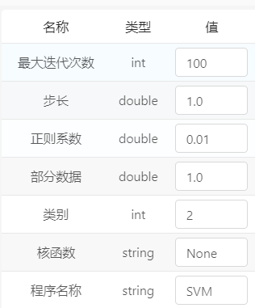

天玑教学平台帮助文档

[TOC]

---

# 算子说明

## 加载类算子

### 数据写入

#### 关系型数据库

算子说明：

将规则的数据按照关联关系将数据写入关系型数据库中

输入参数：

| **序号** | 参数名称  | 参数类型 | 参数说明               |
| -------- | --------- | -------- | ---------------------- |
| 1        | input_pt  | String   | 数据的输入             |
| 2        | table     | String   | 表名                   |
| 3        | url       | String   | 数据库的ip地址         |
| 4        | user      | String   | 数据库用户名           |
| 5        | passwd    | String   | 数据库密码             |
| 6        | format    | String   | 数据输出格式           |
| 7        | is_append | Boolean  | 判断数据是追加还是重写 |

应用场景：

在数据满足数据库写入规则时，可以将大量数据写入到关系型数据库中，为以后的数据展示以及分析做准备。

#### Postgres数据库

算子说明：

将规则数据写入到Postgres数据库中

输入参数：

| **序号** | 参数名称 | 参数类型 | 参数说明       |
| -------- | -------- | -------- | -------------- |
| 1        | input_pt | String   | 数据的输入     |
| 2        | table    | String   | 表名           |
| 3        | url      | String   | 数据库的ip地址 |
| 4        | userName | String   | 数据库用户名   |
| 5        | password | String   | 数据库密码     |
| 6        | format   | String   | 数据输出格式   |
| 7        | db       | String   | 库名称         |

应用场景：

将数据存储到Postgres数据库中做可视化展示

****

#### Mongo数据库

算子说明：

将数据写入到Mongo数据库中

输入参数：

| **序号** | 参数名称 | 参数类型 | 参数说明       |
| -------- | -------- | -------- | -------------- |
| 2        | table    | String   | 表名           |
| 3        | url      | String   | 数据库的ip地址 |
| 4        | userName | String   | 数据库用户名   |
| 5        | password | String   | 数据库密码     |
| 6        | format   | String   | 数据输出格式   |
| 7        | db       | String   | 库名称         |

应用场景：

将数据存储到Mongo数据中

#### Hive数据库

算子说明：

将数据存储到Hive数据仓库中，做数据的大量查询

输入参数：

| **序号** | 参数名称       | 参数类型 | 参数说明               |
| -------- | -------------- | -------- | ---------------------- |
| 1        | input_pt       | String   | 数据的输入             |
| 2        | table          | String   | 表名                   |
| 3        | metastore_uris | String   | 数据库的ip地址         |
| 4        | format         | String   | 数据输出格式           |
| 5        | is_append      | Boolean  | 判断数据是追加还是重写 |

应用场景：

在大量数据查询时，可以做到快速的响应

****

### 数据读取

#### MySQL

算子说明：

读取MySql中数据

输入参数：

| **序号** | 参数名称  | 参数类型 | 参数说明 |
| -------- | --------- | -------- | -------- |
| 1        | output_pt | String   | 数据输出 |
| 2        | format    | String   | 数据格式 |
| 3        | table     | String   | 表名     |
| 4        | url       | String   | 数据库ip |
| 5        | user      | String   | 用户名   |
| 6        | driver    | String   | 驱动     |
| 7        | passwd    | String   | 密码     |
| 8        | columns   | String   | 字段名称 |

应用场景：

将存储在MySql中的数据以csv(多种)的标准格式读取出来，用于后期的数据分析

****

#### Hive

算子说明：

读取Hive中数据

输入参数：

| **序号** | 参数名称  | 参数类型 | 参数说明 |
| -------- | --------- | -------- | -------- |
| 1        | output_pt | String   | 数据输出 |
| 2        | table     | String   | 表名     |
| 3        | format    | String   | 数据格式 |
| 4        | url       | String   | 数据库ip |
| 5        | dataName  | String   | 库名     |
| 6        | columns   | String   | 字段名称 |

应用场景：

将存储在Hive中的数据以csv(多种)的标准格式读取出来，用于后期的数据分析

****

#### FTP

算子说明：

读取FTP中数据

输入参数：

| **序号** | 参数名称  | 参数类型 | 参数说明 |
| -------- | --------- | -------- | -------- |
| 1        | output_pt | String   | 数据输出 |
| 2        | host      | String   | FTP地址  |
| 3        | username  | String   | 用户名   |
| 4        | passwd    | String   | 密码     |
| 5        | path      | String   | 文件路径 |
| 6        | format    | String   | 数据格式 |

应用场景：

将存储在FTP中的数据以csv(多种)的标准格式读取出来，用于后期的数据分析

****

#### Mongo

算子说明：

读取Mongo中数据

输入参数：

| **序号** | 参数名称   | 参数类型 | 参数说明   |
| -------- | ---------- | -------- | ---------- |
| 1        | output_pt  | String   | 数据输出   |
| 2        | format     | String   | 数据格式   |
| 3        | url        | String   | 数据库ip   |
| 4        | database   | String   | 库名称     |
| 5        | collection | String   | 集合名称   |
| 6        | fields     | String   | 字段名称   |
| 7        | slaveOK    | Boolean  | 追加或重写 |

应用场景：

将存储在Mongo中的数据以csv(多种)的标准格式读取出来，用于后期的数据分析

****

#### Greeplum

算子说明：

读取Greeplnum中数据

输入参数：

| **序号** | 参数名称  | 参数类型 | 参数说明 |
| -------- | --------- | -------- | -------- |
| 1        | output_pt | String   | 数据输出 |
| 2        | format    | String   | 数据格式 |
| 3        | table     | String   | 表名     |
| 4        | url       | String   | 数据库ip |
| 5        | user      | String   | 用户名   |
| 6        | driver    | String   | 驱动     |
| 7        | passwd    | String   | 密码     |
| 8        | columns   | String   | 字段名称 |

应用场景：

将存储在Greeplum中的数据以csv(多种)的标准格式读取出来，用于后期的数据分析

----

#### HDFS

算子说明：

读取HDFS中的数据

输入参数：

| **序号** | 参数名称      | 参数类型 | 参数说明   |
| -------- | ------------- | -------- | ---------- |
| 1        | output_pt     | String   | 输入地址   |
| 2        | input_pt      | String   | 数据输出   |
| 3        | splitSymbol   | String   | 分割符号   |
| 4        | inputHeader   | String   | 输入头信息 |
| 5        | dataSource    | String   | 数据源     |
| 6        | output_format | String   | 输出格式   |

应用场景：

将存储在HDFS中的数据读取出来，用于后期的数据分析


----

#### Postgres

算子说明：

读取Postgres中数据

输入参数：

| **序号** | 参数名称  | 参数类型 | 参数说明 |
| -------- | --------- | -------- | -------- |
| 1        | output_pt | String   | 数据输出 |
| 2        | format    | String   | 数据格式 |
| 3        | table     | String   | 表名     |
| 4        | url       | String   | 数据库ip |
| 5        | user      | String   | 用户名   |
| 6        | driver    | String   | 驱动     |
| 7        | passwd    | String   | 密码     |
| 8        | columns   | String   | 字段名称 |

应用场景：

将存储在Postgres中的数据以csv(多种)的标准格式读取出来，用于后期的数据分析

****

#### SqlServer

算子说明：

读取SqlServer中数据

输入参数：

| **序号** | 参数名称  | 参数类型 | 参数说明 |
| -------- | --------- | -------- | -------- |
| 1        | output_pt | String   | 数据输出 |
| 2        | format    | String   | 数据格式 |
| 3        | table     | String   | 表名     |
| 4        | url       | String   | 数据库ip |
| 5        | user      | String   | 用户名   |
| 6        | driver    | String   | 驱动     |
| 7        | passwd    | String   | 密码     |
| 8        | columns   | String   | 字段名称 |

应用场景：

将存储在SqlServer中的数据以csv(多种)的标准格式读取出来，用于后期的数据分析

****

#### Oracle

算子说明：读取Oracle中数据

输入参数：

| **序号** | 参数名称  | 参数类型 | 参数说明 |
| -------- | --------- | -------- | -------- |
| 1        | output_pt | String   | 数据输出 |
| 2        | format    | String   | 数据格式 |
| 3        | table     | String   | 表名     |
| 4        | url       | String   | 数据库ip |
| 5        | user      | String   | 用户名   |
| 6        | driver    | String   | 驱动     |
| 7        | passwd    | String   | 密码     |
| 8        | columns   | String   | 字段名称 |

应用场景：

将存储在Oracle中的数据以csv(多种)的标准格式读取出来，用于后期的数据分析

****

#### 文件下载

算子说明：

读取服务器中数据

输入参数：

| **序号** | 参数名称  | 参数类型 | 参数说明     |
| -------- | --------- | -------- | ------------ |
| 1        | output_pt | String   | 数据输出     |
| 2        | url       | String   | 数据存储地址 |

应用场景：将存储在服务器中的数据读取出来，用于后期的数据分析


## 转换类算子

### 文本处理

#### 分词

- 功能说明

  `分词`将一句话,或文章进行去标点按照词进行分割。

- 参数描述

  | **序号** | 参数名称  | 参数类型 | 参数说明          |
  | -------- | --------- | -------- | ----------------- |
  | 1        | input_pt  | in       | 输入文件路径      |
  | 2        | output_pt | string   | 分词后的文档集合  |
  | 3        | tagged    | out      | 是否包含词性标注  |
  | 4        | has_id    | bool     | 是否包含文档ID    |
  | 5        | has_label | bool     | 是否包含文档Label |
  | 6        | seperator | string   | 分隔符            |

- 应用场景

  某些无法接受类别型特征的算法可以使用，并提高诸如决策树等机器学习算法的效率。

- 示例


#### 特征索引转换

- 功能说明

  `特征索引转换`用在测试集,使索引化过程与训练集保持一致。

- 参数描述

  | **序号** | 参数名称  | 参数类型 | 参数说明     |
  | -------- | --------- | -------- | ------------ |
  | 1        | input_pt  | in       | 输入文件路径 |
  | 2        | output_pt | out      | 输出文件     |
  | 3        | dict_pt   | out      | 输出字典文件 |

- 应用场景

- 示例

#### 特征索引

- 功能说明

  `特征索引`将特征列的字符串编码为标签索引。这些索引是[0,numLabels)，通过标签频率排序，所以频率最高的标签的索引为0.如果输入列是数字，我们把它强转为字符串然后在编码。

- 参数描述

  | **序号** | 参数名称  | 参数类型 | 参数说明     |
  | -------- | --------- | -------- | ------------ |
  | 1        | input_pt  | in       | 输入文件路径 |
  | 2        | output_pt | out      | 输出文件     |
  | 3        | dict_pt   | in       | 输入字典文件 |

- 应用场景

- 示例

#### 词过滤

- 功能说明

  `词过滤`过滤高频词和无意义词,和输入2的输入词。

- 参数描述

  | **序号** | 参数名称     | 参数类型 | 参数说明             |
  | -------- | ------------ | -------- | -------------------- |
  | 1        | doc_pt       | in       | 文档集合文件         |
  | 2        | stopWords_pt | in       | 用词表文件           |
  | 3        | min_freq     | int      | 最低词频             |
  | 4        | topN         | int      | 过滤topN高频词       |
  | 5        | min_len      | int      | 最短词长度           |
  | 6        | max_len      | int      | 最长词长             |
  | 7        | res_pt       | out      | 过滤后的文档集合文件 |

- 应用场景

- 示例

#### TFIDF

- 功能说明

  `TFIDF`词频-逆文档频率法在文本挖掘中广泛使用的特征向量化方法.它反映语料中词对文档的重要程度。假设用t表示词，d表示文档，D表示语料。词频TF(t,d)表示词t在文档d中出现的次数。文档频率DF(t,D)表示语料中出现词t的文档的个数。 如果我们仅仅用词频去衡量重要程度，这很容易过分强调出现频繁但携带较少文档信息的词，如of、the等。如果一个词在语料中出现很频繁，这意味着它不携带特定文档的特殊信息。逆文档频率数值衡量一个词提供多少信息。

- 参数描述

  | **序号** | 参数名称 | 参数类型 | 参数说明         |
  | -------- | -------- | -------- | ---------------- |
  | 1        | doc_pt   | in       | 输入文档集合文件 |
  | 2        | idf_pt   | out      | 词idf文件        |
  | 3        | res_pt   | out      | 结果文件         |

- 应用场景

- 示例

#### TFIDF转换

- 功能说明

  `TFIDF转换`用在测试集,使idf与训练集保持一致。

- 参数描述

  | **序号** | 参数名称 | 参数类型 | 参数说明         |
  | -------- | -------- | -------- | ---------------- |
  | 1        | doc_pt   | in       | 输入文档集合文件 |
  | 2        | idf_pt   | in       | 词idf文件        |
  | 3        | res_pt   | out      | 结果文件         |

- 应用场景

- 示例

#### 词频统计

- 功能说明

  `词频统计`计算每个词出现的个数。

- 参数描述

  | **序号** | 参数名称    | 参数类型 | 参数说明    |
  | -------- | ----------- | -------- | ----------- |
  | 1        | input_pt    | in       | 输入文件    |
  | 2        | output_pt   | out      | 输出文件    |
  | 3        | term_type   | string   | 词项类型    |
  | 4        | is_doc_freq | bool     | is_doc_freq |

- 应用场景

- 示例

#### 词向量索引

- 功能说明

  `词向量索引`将特征列的字符串编码为标签索引。这些索引是[0,numLabels)，通过标签频率排序，所以频率最高的标签的索引为0.如果输入列是数字,我们把它强转为字符串然后在编码。

- 参数描述

  | **序号** | 参数名称 | 参数类型 | 参数说明           |
  | -------- | -------- | -------- | ------------------ |
  | 1        | doc_pt   | in       | 输入文档集合文件   |
  | 2        | res_pt   | out      | 词id表示的文档集合 |
  | 3        | dict_pt  | out      | 词索引列表文件     |

- 应用场景

- 示例

#### 词向量索引转换

- 功能说明

  `word_Index_Transform`用在测试集,使特征索引化与训练集保持一致。

- 参数描述

  | **序号** | 参数名称 | 参数类型 | 参数说明           |
  | -------- | -------- | -------- | ------------------ |
  | 1        | doc_pt   | in       | 输入文档集合文件   |
  | 2        | res_pt   | out      | 词id表示的文档集合 |
  | 3        | dict_pt  | in       | 词索引列表文件     |

- 应用场景

- 示例

#### 线性归一化

- 功能说明

  `线性归一化`转换由向量行组成的数据集，将每个特征调整到一个特定的范围。

- 参数描述

  | **序号** | 参数名称            | 参数类型 | 参数说明 |
  | -------- | ------------------- | -------- | -------- |
  | 1        | input_data_pt       | in       | 输入文件 |
  | 2        | output_data_pt      | out      | 输出文件 |
  | 3        | output_mins_maxs_pt | out      | 输出字典 |

- 应用场景

- 示例

#### 线性归一化字典

- 功能说明

  `线性归一化字典`转换由向量行组成的数据集，根据缩放字典,将每个特征调整到一个特定的范围,用在测试集,使缩放特征效果与训练集相对应。

- 参数描述

  | **序号** | 参数名称           | 参数类型 | 参数说明 |
  | -------- | ------------------ | -------- | -------- |
  | 1        | input_data_pt      | in       | 输入文件 |
  | 2        | input_mins_maxs_pt | in       | 输入字典 |
  | 3        | output_data_pt     | out      | 输出字典 |

- 应用场景

- 示例

#### 文件分割

- 功能说明

  `文件分割`将数据中的,随机抽取行进行文件分割。

- 参数描述

  | **序号** | 参数名称   | 参数类型 | 参数说明           |
  | -------- | ---------- | -------- | ------------------ |
  | 1        | input_pt   | in       | 输入文件           |
  | 2        | ratio      | double   | 切分比例           |
  | 3        | output_pt1 | out      | 输出文件1(ratio)   |
  | 4        | output_pt2 | out      | 输出文件2(1-ratio) |

- 应用场景

- 示例

#### 列选择

- 功能说明

  `Columns_Choose`跟选择列,过滤数据。

- 参数描述

  | **序号** | 参数名称  | 参数类型 | 参数说明        |
  | -------- | --------- | -------- | --------------- |
  | 1        | input_pt  | in       | 输入文件        |
  | 2        | output_pt | out      | 切分比例        |
  | 3        | columns   | string   | 选取的列(1,2,3) |
  | 4        | seperator | string   | 分隔符(\t)      |

- 应用场景

- 示例

#### crf条件随机场

- 功能说明

  `crf条件随机场`在分词、词性标注和命名实体识别有很好的效果。

- 参数描述

  | **序号** | 参数名称        | 参数类型 | 参数说明     |
  | -------- | --------------- | -------- | ------------ |
  | 1        | templateFile_pt | in       | 模板文件     |
  | 2        | input_pt        | in       | 数据输入     |
  | 3        | output_pt       | out      | 数据输出     |
  | 4        | appname         | string   | 应用名称     |
  | 5        | regParam        | double   | 正则化       |
  | 6        | freq            | int      |              |
  | 7        | maxIteration    | double   | 最大迭代次数 |
  | 8        | eta             | double   |              |
  | 9        | regularization  |          |              |

- 应用场景

- 示例

#### crf条件随机场预测

- 功能说明

  `crf条件随机场`使用CRF算法模型对数据进行预测。

- 参数描述

  | **序号** | 参数名称    | 参数类型 | 参数说明 |
  | -------- | ----------- | -------- | -------- |
  | 1        | input_pt    | in       | 数据输入 |
  | 2        | input_model | in       | 模型输入 |
  | 3        | output_pt   | out      | 数据输出 |
  | 4        | appname     | string   | 应用名称 |

- 应用场景

- 示例

------

### 数据转换

#### DirFileMerge

算子说明：

将在一个目录下个多个文件的数据合并在一个文件中

输入参数：

| **序号** | 参数名称 | 参数类型 | 参数说明 |
| -------- | -------- | -------- | -------- |
| 1        | input_pt | String   | 数据输入 |
| 2        | out_put  | String   | 数据输出 |

应用场景：

在文件过多的情况下，将数据进行合并，节省计算时间

****

#### CSVToLabelPoint

算子说明：

将CSV数据转换成LabelPoint

输入参数：

| **序号** | 参数名称      | 参数类型 | 参数说明   |
| -------- | ------------- | -------- | ---------- |
| 1        | input_pt      | String   | 数据输入   |
| 2        | output_pt     | String   | 数据输出   |
| 3        | input_Feature | String   | 选择特征列 |
| 4        | appname       | String   | 程序名称   |

应用场景：

特征工程的过程中，将数据进行特征索引处理，处理之后可以接入算法进行预测

#### 多文件合并

****

#### LibSVM转标注点

算子说明：

将数据转换成LabeledPoint格式

输入参数：

| **序号** | 参数名称  | 参数类型 | 参数说明     |
| -------- | --------- | -------- | ------------ |
| 1        | input_pt  | String   | 数据输入     |
| 2        | output_pt | String   | 数据输出     |
| 3        | is_class  | Boolean  | 是否用作分类 |

应用场景：

数据有很多存储格式，txt格式，xls格式，data格式，csv格式等等，这些数据格式之间都可以互相转换，将这些格式的数据转换成libSvm格式

****

#### Rate转SVDFeature

算子说明：

将数据转换成SVDFeature可识别的格式

输入参数：

| **序号** | 参数名称  | 参数类型 | 参数说明            |
| -------- | --------- | -------- | ------------------- |
| 1        | rates_pt  | String   | 用户评分文件        |
| 2        | points_pt | String   | SVDFeaturePoint文件 |

应用场景：

SVDFeature是有效地解决基于特征的矩阵分解，用于做推荐系统使用，Rate转SVDFeature将数据转换成矩阵能够分解的状态	

****

#### LibFM转标注点

算子说明：

将LibFM 文件转换成LabeledPoint文件

输入参数：

| **序号** | 参数名称  | 参数类型 | 参数说明             |
| -------- | --------- | -------- | -------------------- |
| 1        | input_pt  | String   | LibFM格式数据文件    |
| 2        | output_pt | String   | LabeledPoint数据文件 |

应用场景：

 LibFM把一个训练矩阵R变为一个k-by-m的矩阵 `P'和一个k-by-n的矩阵 `Q'，也就是R近似于 P'Q,近似矩阵分解

****

#### CSV数据分割

算子说明：

将csv格式的数据，按照特定规则进行分割

输入参数：

| **序号** | 参数名称    | 参数类型 | 参数说明 |
| -------- | ----------- | -------- | -------- |
| 1        | input_pt    | String   | 数据输入 |
| 2        | letfColumn  | String   | 预测数据 |
| 3        | rightColumn | String   | 原始数据 |
| 4        | poutput_pt  | String   | 预测输出 |
| 5        | soutput_pt  | String   | 原始输出 |

应用场景：

用于接入可视化算子中，将预测数据与原始数据进行匹配

****

#### Txt转Csv

算子说明：

将预测数据更改为有数据格式的信息

输入参数：

| **序号** | 参数名称   | 参数类型 | 参数说明 |
| -------- | ---------- | -------- | -------- |
| 1        | input_pt   | String   | 数据输入 |
| 2        | output_pt  | String   | 预测数据 |
| 3        | dfinput_pt | String   | 原始数据 |

应用场景：

在算法将数据进行预测之后，将预测的数据创建schema，与可视化算子进行对接

****

#### 格式转换

算子说明：

将数据进行格式转换,tranform a csv,tsv, parquet, json

输入参数：

| **序号** | 参数名称      | 参数类型 | 参数说明 |
| -------- | ------------- | -------- | -------- |
| 1        | input_pt      | String   | 输入格式 |
| 2        | output_pt     | String   | 输出格式 |
| 3        | input_format  | String   | 输入文件 |
| 4        | output_format | String   | 输出文件 |

应用场景：

在数据不相同的情况下，需要将其格式进行转化去做后期的特征工程

****

### 数据采样

#### 过滤与映射

算子说明：

将数据按照正则表达式进行过滤

输入参数：

| **序号** | 参数名称  | 参数类型 | 参数说明     |
| -------- | --------- | -------- | ------------ |
| 1        | input_pt  | String   | 数据输入     |
| 2        | output_pt | String   | 数据输出     |
| 3        | full      | String   | 是否全量匹配 |
| 4        | matchInfo | String   | 匹配符号     |

应用场景：

在数据集不符合规则的情况下，需要用正则表达式进行数据的过滤

### 数据转换

****

#### 分层采样

算子说明：

将数据行不平衡采样

输入参数：

| **序号** | 参数名称    | 参数类型 | 参数说明   |
| -------- | ----------- | -------- | ---------- |
| 1        | input_pt    | String   | 数据输入   |
| 2        | output_pt   | String   | 数据输出   |
| 3        | classify    | String   | 分类标准   |
| 4        | percentage  | String   | 设定比例   |
| 5        | column      | String   | 指定列分层 |
| 6        | splitFormat | String   | 分割标准   |

应用场景：

在进行特征工程时，数据有时会比例失衡，需要将数据进行采样处理，保证数据的平衡防止模型过拟合或者欠拟合

****

#### 加权采样

算子说明：

将数据进行加大比列进行调整

输入参数：

| **序号** | 参数名称    | 参数类型 | 参数说明 |
| -------- | ----------- | -------- | -------- |
| 1        | input_pt    | String   | 数据输入 |
| 2        | output_pt   | String   | 数据输出 |
| 3        | percentage  | String   | 设定比例 |
| 4        | column      | String   | 取列     |
| 5        | splitFormat | String   | 分割方式 |

应用场景：

数据比例不协调时，需要将某一列的是数据进行比列调整

****

### 数据清洗

#### 异常数据处理

算子说明：

将csv格式的数据进行异常处理，选择一字段长度为标准，将一下每行数据进行对比，长度不相同的数据进行剔除

输入参数：

| **序号** | 参数名称  | 参数类型 | 参数说明 |
| -------- | --------- | -------- | -------- |
| 1        | input_pt  | String   | 输入数据 |
| 2        | output_pt | String   | 输出数据 |

应用场景：

需要标准的一行一条数据时，将一条数据多行分割的进行删除

****

#### 缺失值填充

算子说明：

将没条数据中按照某个字段进行规制填充以null的数据

输入参数：

| **序号** | 参数名称     | 参数类型 | 参数说明 |
| -------- | ------------ | -------- | -------- |
| 1        | input_pt     | String   | 数据输入 |
| 2        | output_pt    | String   | 数据输出 |
| 3        | colName      | String   | 字段名称 |
| 4        | chooseType   | String   | 数值类型 |
| 5        | replaceValue | String   | 替换的值 |
| 6        | mathStyle    | String   | 替换方式 |

应用场景：

在进行数据的预测以及特征工程时，噪声数据会对算法产生很大影响，将null值的数据进行删除

****

#### 多列删除

算子说明：

数据进行多列的删除

输入参数：

| **序号** | 参数名称 | 参数类型 | 参数说明 |
| -------- | -------- | -------- | -------- |
| 1        | input_pt | String   | 输入数据 |
| 2        | input_pt | String   | 输出数据 |
| 3        | columns  | String   | 字段名称 |

应用场景：

将从数据库或者文件系统读取出来的数据，做特征工程的期间进行多列的删除

****

#### 数据列合并

算子说明：

将数据中多列进行合并

输入参数：

| **序号** | 参数名称    | 参数类型 | 参数说明 |
| :------- | ----------- | -------- | -------- |
| 1        | input_pt    | String   | 数据输入 |
| 2        | output_pt   | String   | 输出数据 |
| 3        | fileColumns | String   | 合并字段 |
| 4        | newColumn   | String   | 合成字段 |
| 5        | mergeMark   | String   | 拼接符号 |

应用场景：

在数据进行多列处理是，需要将进行合并

****

#### 数据行合并

算子说明：

将数据读取，按照某些字段下的信息进行合并进行输出

输入参数：

| **序号** | 参数名称  | 参数类型 | 参数说明 |
| -------- | --------- | -------- | -------- |
| 1        | input_pt  | String   | 数据输入 |
| 2        | output_pt | String   | 数据输出 |
| 3        | filed     | String   | 字段     |

应用场景：

在数据进行多行处理是，将数据进行合并减少内存使用

****

#### 数据标准化

算子说明：

将数据按照某个字段进行数据的标准化处理

输入参数：

| **序号** | 参数名称  | 参数类型 | 参数说明 |
| -------- | --------- | -------- | -------- |
| 1        | input_pt  | String   | 数据输入 |
| 2        | output_pt | String   | 数据输出 |
| 3        | colNames  | String   | 字段名称 |

应用场景：

在每行数据中有异常数据时需要经数据进行标准化处理

****

#### 数据比列处理

算子说明：


输入参数：

| **序号** | 参数名称 | 参数类型 | 参数说明 |
| -------- | -------- | -------- | -------- |
| 1        |          |          |          |
| 2        |          |          |          |
|          |          |          |          |

输出参数：

应用场景：

****

#### 线性归一化

算子说明：


输入参数：

| **序号** | 参数名称 | 参数类型 | 参数说明 |
| -------- | -------- | -------- | -------- |
| 1        |          |          |          |
| 2        |          |          |          |
|          |          |          |          |

输出参数：

应用场景：

****

线性归一化字典

算子说明：


输入参数：

| **序号** | 参数名称 | 参数类型 | 参数说明 |
| -------- | -------- | -------- | -------- |
| 1        |          |          |          |
| 2        |          |          |          |
|          |          |          |          |

输出参数：

应用场景：

****

## 特征类算子

### 特征转换

#### 特征编码

- 功能说明

  `特征编码`转换器可以把一列类别型的特征（或标签）进行编码，使其数值化，索引的范围从0开始，该过程可以使得相应的特征索引化。

- 参数描述

  | **序号** | 参数名称      | 参数类型 | 参数说明     |
  | -------- | ------------- | -------- | ------------ |
  | 1        | input_pt      | in       | 输入文件路径 |
  | 2        | input_Feature | string   | 选择特征列   |
  | 3        | outmodel_pt   | out      | 输出模型     |
  | 4        | output_pt     | out      | 输出文件路径 |
  | 5        | appname       |          | 程序名称     |

- 应用场景

  某些无法接受类别型特征的算法可以使用，并提高诸如决策树等机器学习算法的效率。

- 示例

  ```scala
  +---+--------+-------------+
  | id|category|categoryIndex|
  +---+--------+-------------+
  |  0|       a|          0.0|
  |  1|       b|          2.0|
  |  2|       c|          1.0|
  |  3|       a|          0.0|
  |  4|       a|          0.0|
  |  5|       c|          1.0|
  +---+--------+-------------+
  ```

#### 特征编码转换

- 功能说明

  `特征编码转换`转化器可以将测试数据或预测数据中的类别性的列编码,编码会和训练集的特征列编码保持一致

- 参数描述

  | **序号** | 参数名称      | 参数类型 | 参数说明     |
  | -------- | ------------- | -------- | ------------ |
  | 1        | input_pt      | in       | 输入文件路径 |
  | 2        | inputModle_pt | in       | 输入模型路径 |
  | 3        | output_pt     | out      | 输出文件路径 |
  | 4        | appname       |          | 程序名称     |

- 应用场景

  测试或者预测数据的词索引转化,需要`StringIndex`生成Model

#### 数据分箱

- 功能说明

  `Bucketizer`分箱将连续数据离散化到指定的范围区间。这些区间由用户指定。它拥有一个`splits`参数。

- 参数描述

  | **序号** | 参数名称      | 参数类型 | 参数说明             |
  | -------- | ------------- | -------- | -------------------- |
  | 1        | input_pt      | in       | 输入文件路径         |
  | 2        | input_Feature | string   | 输入特征列           |
  | 3        | output_pt     | out      | 输出文件路径         |
  | 4        | featureSpilt  | string   | 分箱区间(如10,20,30) |
  | 5        | appname       |          | 程序名称             |

- 应用场景

  连续的特征列,在用户指定区间进行划分

- 示例

  ```scala
  val splits: Array[Double] = Array(-180,-160,-100,-50,-70,-20,-8,-5,-3, 0.0, 1,3,7,10,30,60,90,100,120,150)
  +--------+----------------+
  |features|bucketedFeatures|
  +--------+----------------+
  |-180.0  |0.0             |
  |-160.0  |0.0             |
  |-100.0  |1.0             |
  |-50.0   |1.0             |
  |-70.0   |1.0             |
  |-20.0   |1.0             |
  |-8.0    |2.0             |
  |-5.0    |2.0             |
  |-3.0    |2.0             |
  |0.0     |3.0             |
  |1.0     |3.0             |
  |3.0     |3.0             |
  |7.0     |3.0             |
  |10.0    |4.0             |
  |30.0    |4.0             |
  |60.0    |4.0             |
  |90.0    |5.0             |
  |100.0   |5.0             |
  |120.0   |5.0             |
  |150.0   |5.0             |
  +--------+----------------+
  ```

#### 特征离散

- 功能说明

  `特征离散`分位树为数离散化，和`数据分箱处理一样也是：将连续数值特征转换为离散类别特征,
  参数1：不同的是这里不再自己定义splits（分类标准），而是定义分几箱(段）就可以了。

- 参数描述

  | **序号** | 参数名称      | 参数类型 | 参数说明       |
  | -------- | ------------- | -------- | -------------- |
  | 1        | input_pt      | in       | 输入文件路径   |
  | 2        | input_Feature | string   | 输入特征列     |
  | 3        | output_pt     | out      | 输出文件路径   |
  | 4        | numBuckets    | int      | 离散数         |
  | 5        | relativeError | double   | 误差值,一般0.1 |
  | 6        | outmodel_pt   | out      | 输出模型       |
  | 7        | appname       |          | 名称           |

- 应用场景

  连续的特征列,在用户指定数目进行离散化

#### 特征离散转换

- 功能说明

  `特征离散转换`在测试数据预测数据中进行离散,会和训练的离散保持一致。

- 参数描述

  | **序号** | 参数名称      | 参数类型 | 参数说明     |
  | -------- | ------------- | -------- | ------------ |
  | 1        | input_pt      | in       | 输入文件路径 |
  | 2        | inputModle_pt | in       | 输入模型路径 |
  | 3        | output_pt     | out      | 输出文件路径 |
  | 4        | appname       |          | 程序名称     |

- 应用场景

  在测试数据需要根据训练数据的离散规格进行离散时使用

#### OneHot

- 功能说明

  `OneHot`把一列标签索引映射成一列二进制数组，且最多的时候只有一位有效。

- 参数描述

  | **序号** | 参数名称      | 参数类型 | 参数说明        |
  | -------- | ------------- | -------- | --------------- |
  | 1        | input_pt      | in       | 输入文件路径    |
  | 2        | input_Feature | string   | 输入特征列      |
  | 3        | output_pt     | out      | 输出文件路径    |
  | 4        | label_pt      | int      | 指定label列名称 |
  | 5        | outmodel_pt   | out      | 输出模型        |
  | 6        | appname       |          | 名称            |

- 应用场景

  这种编码适合一些期望类别特征为连续特征的算法,比如逻辑斯蒂回归。

#### OneHot转换

- 功能说明

  `OneHot转换`是使用在测试和预测数据进行的特征转换,会和训练集的编码保持一致

- 参数描述

  | **序号** | 参数名称      | 参数类型 | 参数说明     |
  | -------- | ------------- | -------- | ------------ |
  | 1        | input_pt      | in       | 输入文件路径 |
  | 2        | inputModle_pt | in       | 输入模型路径 |
  | 3        | output_pt     | out      | 输出文件路径 |
  | 4        | label_pt      | string   | label列      |
  | 5        | appname       |          | 程序名称     |

- 应用场景

  测试预测数据需要`OneHot`的数据

****

### 特征选择

#### 卡方选择器

- 功能说明

  `卡方选择器`是在特征向量中选择出那些“优秀”的特征，组成新的、更“精简”的特征向量的过程。卡方选择则是统计学上常用的一种有监督特征选择方法，它通过对特征和真实标签之间进行卡方检验，来判断该特征和真实标签的关联程度，进而确定是否对其进行选择。

- 参数说明

  | **序号** | 参数名称      | 参数类型 | 参数说明           |
  | -------- | ------------- | -------- | ------------------ |
  | 1        | input_pt      | in       | 输入labelpoint文件 |
  | 2        | input_Feature | string   | 输入特征列         |
  | 3        | output_pt     | out      | 输出文件路径       |
  | 4        | outModel_pt   | out      | 输出模型           |
  | 5        | appname       |          | 程序名称           |

- 应用场景

  它在高维数据分析中十分常用，可以剔除掉“冗余”和“无关”的特征，提升学习器的性能

#### 卡方选择器转换

- 功能说明	

  `卡方选择器转换`是用在测试或预测数据的卡方选择器。

- 参数说明

  | **序号** | 参数名称      | 参数类型 | 参数说明     |
  | -------- | ------------- | -------- | ------------ |
  | 1        | input_pt      | in       | 输入文件路径 |
  | 2        | inputModle_pt | in       | 输入模型路径 |
  | 3        | output_pt     | out      | 输出文件路径 |
  | 4        | appname       |          | 程序名称     |

#### 奇异值分解

- 功能说明	

  `SVD`奇异值分解(Singular Value Decomposition，以下简称SVD)是在机器学习领域广泛应用的算法，可以用于降维算法中的特征分解。

- 参数说明

  | **序号** | 参数名称  | 参数类型 | 参数说明     |
  | -------- | --------- | -------- | ------------ |
  | 1        | input_pt  | in       | 输入文件路径 |
  | 2        | numK      | int      | 降维数       |
  | 3        | output_pt | out      | 输出v        |
  | 4        | outsvds   | out      | 输出s        |
  | 5        | appname   |          | 程序名称     |

#### 非负矩阵分解

- 功能说明	

  `非负矩阵分解`非负矩阵分解(non-negative matrix factorization，以下简称NMF)是一种非常常用的矩阵分解方法，它可以适用于很多领域，比如图像特征识别，语音识别等。

- 参数说明

  | **序号** | 参数名称 | 参数类型 | 参数说明     |
  | -------- | -------- | -------- | ------------ |
  | 1        | input_pt | in       | 输入文件路径 |
  | 2        | numK     | int      | 降维数       |
  | 3        | output_W | out      | 输出矩阵W    |
  | 4        | output_H | out      | 输出矩阵H    |
  | 5        | maxIter  | int      | 迭代次数     |
  | 6        | appname  |          | 程序名称     |


****

### 特征抽取

#### 主成分分析（PCA）

**算子说明：**

PCA是一种较为常用的降维技术，PCA的主要思想是将维特征映射到维上，这维是全新的正交特征。这维特征称为正元，是重新构造出来的特征维。在PCA中，数据从原来的坐标系转到新的坐标系下，新的坐标系的选择与数据本身是密切相关的。其中，第一个新坐标轴选择的是原始数据中方差最大的方向，第二个新坐标轴选取的是与第一个坐标轴正交且具有最大方差的方向，依次类推。

​       它能起到的作用有两个：一个是节约存储空间，当数据量过多时，通过减少减少几个维度就可以节约很多空间；另一个是提供计算的速度，将数据降维后，无论是样本数据训练时，还有对新数据做出响应时，速度都会大幅提高。

**输入参数：**

| **序号** | 参数名称    | 参数类型 | 参数说明     |
| :------: | ----------- | -------- | ------------ |
|    1     | input_pt    | String   | 输入数据目录 |
|    2     | pcaNum      | Int      | 主成维度     |
|    3     | appname     | String   | 任务名称     |
|    4     | outmodel_pt | String   | 模型输出路径 |
|    5     | output_pt   | String   | 输出数据路径 |

**输出参数：**

| 序号 | 参数名称    | 参数类型 | 参数说明     |
| :--: | ----------- | -------- | ------------ |
|  1   | outmodel_pt | String   | 模型输出路径 |
|  2   | output_pt   | String   | 输出数据路径 |

**应用场景：**

PCA方法常用于人脸识别,数据分析。

 (1)  非监督式的数据集

​	一种非监督式的降维方法，因此适用于不带有标签的数据集，<u>*对于带标签的可以采用LDA*</u>。

 (2)   根据方差自主控制特征数量

​	最大的主成分的数量会小于或等于特征的数量，即，PCA可以输出全部的特征，具体取决于选择特征中解释的方差比例。

 (3)  更少的正则化处理

​	选择较多的主成分将导致更少的平滑，因为能保留很多特征，减少正则化。

 (4)  数据量较大的数据集

​	数据量大指数据记录多和维度多两种情况，PCA对大型数据集的处理效率高。

 (5)  数据分布式位于相同平面上，数据中存在线性结构

****

#### 主成分分析转换

算子说明：


输入参数：

| **序号** | 参数名称      | 参数类型 | 参数说明 |
| -------- | ------------- | -------- | -------- |
| 1        | input_pt      | in       | 输入数据 |
| 2        | inputModle_pt | in       | 输入模型 |
| 3        | pcaNum        | int      | 主成维度 |
| 4        | output_pt     | out      | 输出数据 |
| 5        | appname       | string   | 应用名称 |

应用场景：

****

## 统计类算子

### 相关分析

#### 相关分析

- 功能说明

  `相关分析`相关性分析和卡方独立性校验的测试数据为两行，代表来自两个样本的数据，偏相关分析的测试数据为n行，数据用“,”分隔

- 参数描述

  | **序号** | 参数名称 | 参数类型 | 参数说明                                      |
  | -------- | -------- | -------- | --------------------------------------------- |
  | 1        | input_pt | in       | 数据输入                                      |
  | 2        | test     | string   | 1是相关性分析 2是偏相关分析 3是卡方独立性检验 |

- 应用场景

- 示例

#### 时间序列分析

- 功能说明

  `时间序列分析`测试数据为2行，第一行代表开始和结束时间，第二行是时序数据，数据用“,”分隔。

- 参数描述

  | **序号** | 参数名称 | 参数类型 | 参数说明                                                   |
  | -------- | -------- | -------- | ---------------------------------------------------------- |
  | 1        | input_pt | in       | 数据输入                                                   |
  | 2        | method   | string   | 1是时序图 2是自相关图 3是偏自相关图 4是训练ARIMA模型并预测 |
  | 3        | d        | string   | 差分的阶数                                                 |
  | 4        | p        | string   | 自相关系数                                                 |
  | 5        | q        | string   | 移动平均系数                                               |
  | 6        | begin    | string   | 开始时间                                                   |
  | 7        | end      | string   | 结束时间                                                   |

- 应用场景

- 示例

****

### 数据校验

#### T校验

- 功能说明

  `T校验`亦称 student t 检验（Student's t test），主要用于样本含量较小（例如n<30）， 总体标准差σ未知的正态分布资料。

- 参数描述

  | **序号** | 参数名称 | 参数类型 | 参数说明                                                     |
  | -------- | -------- | -------- | ------------------------------------------------------------ |
  | 1        | input_pt | in       | 数据输入                                                     |
  | 2        | method   | string   | 1表示一组分数的平均值，2表示两个独立的分数样本，3表示两个相关的分数样本，默认值为1。 |
  | 3        | mean     | string   | 平均数                                                       |

- 应用场景

- 示例

#### Wilcoxon检验

- 功能说明

  `Wilcoxon检验`符号秩检验:把观测值和零假设的中心位置之差的绝对值的秩分别按照不同的符号相加作为其检验统计量

- 参数描述

  | **序号** | 参数名称 | 参数类型 | 参数说明                  |
  | -------- | -------- | -------- | ------------------------- |
  | 1        | input_pt | in       | 数据输入                  |
  | 2        | test     | string   | 1是符号秩检验 2是秩和检验 |

- 应用场景

- 示例

#### 方差分析

- 功能说明

  `方差分析`通过比较两组数据的方差，来判断两组数据是否存在较大的偶然误差， 是精密度检验

- 参数描述

  | **序号** | 参数名称 | 参数类型 | 参数说明                       |
  | -------- | -------- | -------- | ------------------------------ |
  | 1        | input_pt | in       | 数据输入                       |
  | 2        | test     | string   | 1是F校验 2是Ansari-Bradley检验 |

- 应用场景

- 示例

#### 正态分布检验

- 功能说明

  `正态分布检验`检验数据是否服从正态分布，输出结果为 p 值， 如果 p 值小于置信水平0.05， 则拒绝原假设，即数据不服从正态分布

- 参数描述

  | **序号** | 参数名称 | 参数类型 | 参数说明                  |
  | -------- | -------- | -------- | ------------------------- |
  | 1        | input_pt | in       | 数据输入                  |
  | 2        | test     | string   | 1是正太分布校验 2是KS校验 |

- 应用场景

- 示例

****

### 参数估计

#### 方差估计

- 功能说明

  `方差估计`根据从总体中抽取的样本估计总体分布中方差的方法。

- 参数描述

  | **序号** | 参数名称 | 参数类型 | 参数说明 |
  | -------- | -------- | -------- | -------- |
  | 1        | input_pt | in       | 数据输入 |
  | 2        | appname  | string   | 应用名称 |

- 应用场景

- 示例

#### 方差比估计

- 功能说明

  `方差比估计`来自两总体的样本数据估计两总体的方差之比，判断两份样本稳定程度。

- 参数描述

  | **序号** | 参数名称 | 参数类型 | 参数说明 |
  | -------- | -------- | -------- | -------- |
  | 1        | input_pt | in       | 数据输入 |
  | 2        | input_pf | in       | 数据输入 |
  | 3        | appname  | string   | 应用名称 |

- 应用场景

- 示例

#### 比率估计

- 功能说明

  `比率估计`根据样本的数据来估计总体中'1'所占的比例。

- 参数描述

  | **序号** | 参数名称      | 参数类型 | 参数说明 |
  | -------- | ------------- | -------- | -------- |
  | 1        | input_pt      | in       | 数据输入 |
  | 2        | molecular_str | string   | 分子     |
  | 3        | select_col    | string   | 选择列   |
  | 4        | appname       | string   | 应用名称 |

- 应用场景

- 示例

#### 比率差估计

- 功能说明

  `比率差估计`根据样本X和样本Y估计总体X和总体Y的比率之差,判断两份样本中'1'所占的比例。

- 参数描述

  | **序号** | 参数名称      | 参数类型 | 参数说明 |
  | -------- | ------------- | -------- | -------- |
  | 1        | input_pt      | in       | 数据输入 |
  | 2        | input_pf      | in       | 数据输入 |
  | 3        | select_col    | string   | 选择列   |
  | 4        | molecular_str | string   | 选择列   |
  | 5        | appname       | string   | 应用名称 |

- 应用场景

- 示例

****

#### 比率差估计

算子说明：


输入参数：

| **序号** | 参数名称 | 参数类型 | 参数说明 |
| -------- | -------- | -------- | -------- |
| 1        |          |          |          |
| 2        |          |          |          |
|          |          |          |          |

输出参数：

应用场景：

****

#### 比率估计

算子说明：


输入参数：

| **序号** | 参数名称 | 参数类型 | 参数说明 |
| -------- | -------- | -------- | -------- |
| 1        |          |          |          |
| 2        |          |          |          |
|          |          |          |          |

输出参数：

应用场景：

****

## 算法类算子

### 模型评估

#### 二分类评价

算子说明：

评价分类问题的性能的指标一般是分类准确率，其定义是对于给定的数据，分类正确的样本数占总样本数的比例

输入参数：

| **序号** | 参数名称   | 参数类型 | 参数说明 |
| -------- | ---------- | -------- | -------- |
| 1        | predict_pt | String   | 评价输出 |

应用场景：

在二分类算法预测数据输出时，将数据接入分类评价，会计算出召回率、准确率相关信息

****

#### 多分类评价

算子说明：

将算法预测出来的数据，对预测做评价

输入参数：

| **序号** | 参数名称   | 参数类型 | 参数说明 |
| -------- | ---------- | -------- | -------- |
| 1        | predict_pt | String   | 评价输出 |

输出参数：

应用场景：

在多分类算法预测数据输出时，将数据接入分类评价，会计算出召回率、准确率相关信息

****

#### 困惑度评价

算子说明：

将算法预测出来的数据，对预测做评价

输入参数：

| **序号** | 参数名称 | 参数类型 | 参数说明         |
| -------- | -------- | -------- | ---------------- |
| 1        | model_pt | String   | 输出模型文件     |
| 2        | doc_pt   | String   | 测试文档集合文件 |
| 3        | graphx   | Boolean  | 是否使用GraphX   |

输出参数：

应用场景：

用来度量一个概率分布或概率模型预测样本的好坏程度。它也可以用来比较两个概率分布或概率模型

****

#### 均方根误差

算子说明：

将算法预测出来的数据，对预测做评价

输入参数：

| **序号** | 参数名称   | 参数类型 | 参数说明 |
| -------- | ---------- | -------- | -------- |
| 1        | predict_pt | String   | 预测输入 |

输出参数：

应用场景：

均方根误差是观测值与真值偏差的平方与观测次数n比值的平方根，在实际测量中，观测次数n总是有限的，真值只能用最可信赖（最佳）值来代替

****

### 深度学习

#### CNN预测

算子说明：

CNN 卷积神经网络预测。Tensorflow单机模式实现

输入参数：

| **序号** | 参数名称 | 参数类型 | 参数说明 |
| -------- | -------- | -------- | -------- |
| 1        | 默认     | String   | data     |
| 2        | 默认     | String   | model    |
| 3        | 默认     | String   | output   |

输出参数：

应用场景：

CNN 卷积神经网络预测。Tensorflow单机模式实现

****

#### CNN数据并行

算子说明：

CNN 卷积神经网络训练模型，采用Tensorflow 数据并行实现分布式计算

输入参数：

| **序号** | 参数名称 | 参数类型 | 参数说明 |
| -------- | -------- | -------- | -------- |
| 1        | 默认     | String   | input    |
| 2        | 默认     | String   | output   |

输出参数：

应用场景：

CNN 卷积神经网络训练模型，采用Tensorflow 数据并行实现分布式计算

****

#### CNN模型并行

算子说明：

CNN 卷积神经网络模型训练，采用Tensorflow模型并行实现分布式计算

输入参数：

| **序号** | 参数名称 | 参数类型  | 参数说明 |
| -------- | -------- | --------- | -------- |
| 1        | 默认     | String    | input    |
| 2        | 默认     | Directory | output   |

输出参数：

应用场景：

CNN 卷积神经网络模型训练，采用Tensorflow模型并行实现分布式计算

****

### 网络计算

#### 独立级联模型

算子说明：


输入参数：

| **序号** | 参数名称 | 参数类型 | 参数说明 |
| -------- | -------- | -------- | -------- |
| 1        |          |          |          |
| 2        |          |          |          |
|          |          |          |          |

输出参数：

应用场景：

****

#### Kshell

算子说明：

度量图中各个节点的影响力

输入参数：

| **序号** | 参数名称    | 参数类型 | 参数说明   |
| -------- | ----------- | -------- | ---------- |
| 1        | edge_pt     | String   | 训练集合   |
| 2        | model_pt    | String   | 模型文件   |
| 3        | dir         | String   | 方向       |
| 4        | weight      | Boolean  | 是否带权重 |
| 5        | n_partition | Int      | 分区       |

输出参数：

应用场景：

度量图中各个节点的影响力

****

#### KshellTopK

算子说明：

输出节点中排序前topK的顶点

输入参数：

| **序号** | 参数名称  | 参数类型 | 参数说明 |
| -------- | --------- | -------- | -------- |
| 1        | model_pt  | String   | 模型     |
| 2        | output_pt | String   | 输出文件 |
| 3        | topK      | Int      | 前多少个 |

输出参数：

应用场景：

度量图中各个节点的影响力

****

#### PageRank

算子说明：

用模型文件存储各个节点的的pagerank值

输入参数：

| **序号** | 参数名称       | 参数类型 | 参数说明       |
| -------- | -------------- | -------- | -------------- |
| 1        | edge_pt        | String   | 训练集合       |
| 2        | model_pt       | String   | 模型文件       |
| 3        | max_iter       | Int      | 迭代次数       |
| 4        | damping_factor | Double   | damping_factor |

输出参数：

应用场景：

用模型文件存储各个节点的的pagerank值

****

#### PageRankTopK

算子说明：

返回节点的topK个节点

输入参数：

| **序号** | 参数名称  | 参数类型 | 参数说明 |
| -------- | --------- | -------- | -------- |
| 1        | model_pt  | String   | 模型     |
| 2        | output_pt | String   | 输出文件 |
| 3        | topK      | Int      | 前多少   |

输出参数：

应用场景：

将返回节点的topK个节点

****

### 文本分析

#### LDA主题

算子说明：

一种文档主题生成模型，也称为一个三层贝叶斯概率模型，包含词、主题和文档三层结构。所谓生成模型，就是说，我们认为一篇文章的每个词都是通过“以一定概率选择了某个主题，并从这个主题中以一定概率选择某个词语”这样一个过程得到。文档到主题服从多项式分布，主题到词服从多项式分布

输入参数：

| **序号** | 参数名称 | 参数类型 | 参数说明       |
| -------- | -------- | -------- | -------------- |
| 1        | train_pt | String   | 词id表示的文档 |
| 2        | model_pt | String   | 模型文件       |
| 3        | K        | Int      | topic个数      |
| 4        | alpha    | Double   | alpha          |
| 5        | beta     | Double   | beta           |
| 6        | max_iter | Int      | 迭代轮数       |
| 7        | graphx   | Boolean  | 是否使用GraphX |
| 8        | pz_d_pt  | String   | 文档的话题分布 |

输出参数：

应用场景：

是一种文档主题生成模型，也称为一个三层贝叶斯概率模型，包含词、主题和文档三层结构。所谓生成模型，就是说，我们认为一篇文章的每个词都是通过“以一定概率选择了某个主题，并从这个主题中以一定概率选择某个词语”这样一个过程得到。文档到主题服从多项式分布，主题到词服从多项式分布

****

#### LDA主题预测

算子说明：

对文档预测话题 P(z|d)

输入参数：

| **序号** | 参数名称 | 参数类型 | 参数说明     |
| -------- | -------- | -------- | ------------ |
| 1        | model_pt | String   | 训练模型     |
| 2        | test_pt  | String   | 测试集合     |
| 3        | pz_d_pt  | String   | 话题分布     |
| 4        | graphx   | Boolean  | 否使用GraphX |

输出参数：

应用场景：

对文档预测话题 P(z|d)

****

### 推荐算法

#### 协同过滤

- 功能说明

  `协同过滤`是一种基于一组兴趣相同的用户或项目进行的推荐，它根据邻居用户(与目标用户兴趣相似的用户)的偏好信息产生对目标用户的推荐列表。

- 参数描述

  | **序号** | 参数名称      | 参数类型 | 参数说明                           |
  | -------- | ------------- | -------- | ---------------------------------- |
  | 1        | input_pt      | in       | 输入文件路径                       |
  | 2        | rank          | int      | 模型中隐语义因子的个数（默认为10） |
  | 3        | numIterations | int      | 最大迭代次数                       |
  | 4        | outmodel_pt   | out      | 输出模型                           |
  | 6        | appname       |          | 程序名称                           |

- 应用场景

  推介系统

#### 协同过滤预测

- 功能说明

  `协同过滤预测`是`协同过滤`在测试或预测集上的应用

- 参数描述

  | **序号** | 参数名称      | 参数类型 | 参数说明     |
  | -------- | ------------- | -------- | ------------ |
  | 1        | input_pt      | in       | 输入文件路径 |
  | 2        | inputModle_pt | in       | 输入模型路径 |
  | 3        | output_pt     | out      | 输出文件路径 |
  | 4        | appname       |          | 程序名称     |

- 示例

  训练数据

  | 评分 | 用户id | 电影id |
  | ---- | ---- | ---- |
  |3.5|1|5|
  |3.5|1|6|
  |4.0|2|2|
  |5.0|2|7|
  |5.0|2|8|
  |4.0|2|9|
  |3.0|2|10|
  |4.0|3|1|
  |3.0|3|11|
  |4.0|3|3|
  |5.0|3|5|

  测试数据

  | 评分 | 用户id | 电影id |
  | ---- | ---- | ---- |
  |4.0|1|1|
  |3.0|1|11|
  |4.0|1|3|
  |5.0|1|5|
  |3.5|2|5|
  |3.5|2|3|
  |3.5|2|4|
  |3.5|2|5|
  |3.5|2|6|
  |4.0|3|1|
  |3.0|3|11|
  |4.0|3|3|
  |5.0|3|5|

  1.画图

  

  2.预测结果

  | prediction | 评分 | 用户id | 电影id |
  | ---- | ---- | ---- | ---- |
  |4.0|4.0|1|1|
  |3.0|3.0|1|11|
  |4.0|4.0|1|3|
  |5.0|5.0|1|5|
  |3.5|3.5|2|5|
  |3.5|3.5|2|3|
  |3.5|3.5|2|4|
  |3.5|3.5|2|5|
  |3.5|3.5|2|6|
  |4.0|4.0|3|1|
  |3.0|3.0|3|11|
  |4.0|4.0|3|3|
  |5.0|5.0|3|5|


****

#### 因子分解机

- 功能说明

  `因子分解机`因子分解机也是推荐系统算法。 对于因子分解机来说，最大的特点是对于稀疏的数据具有很好的学习能力。因子分解机FM算法可以处理如下三类问题：回归问题；二分类问题；排序。

- 参数描述

  | **序号** | 参数名称      | 参数类型 | 参数说明             |
  | -------- | ------------- | -------- | -------------------- |
  | 1        | train_pt      | in       | 训练集               |
  | 2        | validate_pt   | in       | 校验集               |
  | 3        | model_pt      | out      | 模型文件             |
  | 4        | is_regression | bool     | 回归or分类           |
  | 5        | graphx        | bool     | 是否使用GraphX       |
  | 6        | n_partition   | int      | 分区                 |
  | 7        | learn_rate    | double   | 学习率               |
  | 8        | k1            | bool     | 权重                 |
  | 9        | k2            | int      | 维数                 |
  | 10       | reg2          | double   | 双向相互作用的正则化 |
  | 11       | stdev         | double   | 方差                 |
  | 12       | split_ratio   | double   | 比例                 |
  | 13       | max_iter      | int      | 最大迭代次数         |
  | 14       | reg1          | double   | 单向相互作用的正则化 |

- 应用场景

- 示例

#### 因子分解机预测

- 功能说明

  `因子分解机预测`使用因子分解机的模型对数据进行预测。

- 参数描述

  | **序号** | 参数名称    | 参数类型 | 参数说明       |
  | -------- | ----------- | -------- | -------------- |
  | 1        | test_pt     | in       | 测试数据       |
  | 2        | model_pt    | in       | 模型           |
  | 3        | output_pt   | out      | 数据输出       |
  | 4        | graphx      | bool     | 是否使用GraphX |
  | 5        | n_partition | int      | 分区           |

- 应用场景

- 示例

  训练数据

  | 评分 | 用户id | 电影id |
  | ---- | ------ | ------ |
  | 3.5  | 1      | 5      |
  | 3.5  | 1      | 6      |
  | 4.0  | 2      | 2      |
  | 5.0  | 2      | 7      |
  | 5.0  | 2      | 8      |
  | 4.0  | 2      | 9      |
  | 3.0  | 2      | 10     |
  | 4.0  | 3      | 1      |
  | 3.0  | 3      | 11     |
  | 4.0  | 3      | 3      |
  | 5.0  | 3      | 5      |

  测试数据

  | 评分 | 用户id | 电影id |
  | ---- | ------ | ------ |
  | 4.0  | 1      | 1      |
  | 3.0  | 1      | 11     |
  | 4.0  | 1      | 3      |
  | 5.0  | 1      | 5      |
  | 3.5  | 2      | 5      |
  | 3.5  | 2      | 3      |
  | 3.5  | 2      | 4      |
  | 3.5  | 2      | 5      |
  | 3.5  | 2      | 6      |
  | 4.0  | 3      | 1      |
  | 3.0  | 3      | 11     |
  | 4.0  | 3      | 3      |
  | 5.0  | 3      | 5      |

  1.画图

  

  2.预测结果

  | prediction | 评分 | 用户id | 电影id |
  | ---------- | ---- | ------ | ------ |
  | 4.0        | 4.0  | 1      | 1      |
  | 3.0        | 3.0  | 1      | 11     |
  | 4.0        | 4.0  | 1      | 3      |
  | 5.0        | 5.0  | 1      | 5      |
  | 3.5        | 3.5  | 2      | 5      |
  | 3.5        | 3.5  | 2      | 3      |
  | 3.5        | 3.5  | 2      | 4      |
  | 3.5        | 3.5  | 2      | 5      |
  | 3.5        | 3.5  | 2      | 6      |
  | 4.0        | 4.0  | 3      | 1      |
  | 3.0        | 3.0  | 3      | 11     |
  | 4.0        | 4.0  | 3      | 3      |
  | 5.0        | 5.0  | 3      | 5      |


****

#### SVDFeature

- 功能说明

  `SVDFeature`使用场景:评分预测,商品推荐。

- 参数描述

  | **序号** | 参数名称      | 参数类型 | 参数说明     |
  | -------- | ------------- | -------- | ------------ |
  | 1        | train_pt      | in       | 训练集       |
  | 2        | validate_pt   | in       | 校验集       |
  | 3        | model_pt      | out      | 模型文件     |
  | 4        | is_regression | bool     | 是否为回归   |
  | 5        | K             | int      | 子空间维度   |
  | 6        | learn_rate    | double   | 学习率       |
  | 7        | reg           | double   | 正则项系数   |
  | 8        | max_iter      | int      | 最大迭代次数 |

- 应用场景

- 示例

#### SVDFeature预测

- 功能说明

  `SVDFeature预测`使用SVDFeature算法的模型对数据进行预测。

- 参数描述

  | **序号** | 参数名称   | 参数类型 | 参数说明           |
  | -------- | ---------- | -------- | ------------------ |
  | 1        | model_pt   | in       | 训练好的模型       |
  | 2        | test_pt    | in       | 测试文档集合       |
  | 3        | predict_pt | out      | 文档的话题分布文件 |

- 应用场景

- 示例

  训练数据

  | 评分 | 用户id | 电影id |
  | ---- | ------ | ------ |
  | 3.5  | 1      | 5      |
  | 3.5  | 1      | 6      |
  | 4.0  | 2      | 2      |
  | 5.0  | 2      | 7      |
  | 5.0  | 2      | 8      |
  | 4.0  | 2      | 9      |
  | 3.0  | 2      | 10     |
  | 4.0  | 3      | 1      |
  | 3.0  | 3      | 11     |
  | 4.0  | 3      | 3      |
  | 5.0  | 3      | 5      |

  测试数据

  | 评分 | 用户id | 电影id |
  | ---- | ------ | ------ |
  | 4.0  | 1      | 1      |
  | 3.0  | 1      | 11     |
  | 4.0  | 1      | 3      |
  | 5.0  | 1      | 5      |
  | 3.5  | 2      | 5      |
  | 3.5  | 2      | 3      |
  | 3.5  | 2      | 4      |
  | 3.5  | 2      | 5      |
  | 3.5  | 2      | 6      |
  | 4.0  | 3      | 1      |
  | 3.0  | 3      | 11     |
  | 4.0  | 3      | 3      |
  | 5.0  | 3      | 5      |

  1.画图

  

  2.预测结果

  | prediction | 评分 | 用户id | 电影id |
  | ---------- | ---- | ------ | ------ |
  | 4.0        | 4.0  | 1      | 1      |
  | 3.0        | 3.0  | 1      | 11     |
  | 4.0        | 4.0  | 1      | 3      |
  | 5.0        | 5.0  | 1      | 5      |
  | 3.5        | 3.5  | 2      | 5      |
  | 3.5        | 3.5  | 2      | 3      |
  | 3.5        | 3.5  | 2      | 4      |
  | 3.5        | 3.5  | 2      | 5      |
  | 3.5        | 3.5  | 2      | 6      |
  | 4.0        | 4.0  | 3      | 1      |
  | 3.0        | 3.0  | 3      | 11     |
  | 4.0        | 4.0  | 3      | 3      |
  | 5.0        | 5.0  | 3      | 5      |


****

#### 非负矩阵分解

- 功能说明

  `非负矩阵分解`使用场景:评分预测,商品推荐。

- 参数描述

  | **序号** | 参数名称    | 参数类型 | 参数说明         |
  | -------- | ----------- | -------- | ---------------- |
  | 1        | train_pt    | in       | 训练集           |
  | 2        | validate_pt | in       | 校验集           |
  | 3        | model_pt    | out      | 模型文件         |
  | 4        | n_partition | int      | RDD分区数        |
  | 5        | graphx      | bool     | 是否使用GraphX   |
  | 6        | split_ratio | double   | 训练样本切分比例 |
  | 7        | K           | int      | 子空间维度       |
  | 8        | learn_rate  | double   | 学习率           |
  | 9        | reg         | double   | 正则化           |
  | 10       | max_iter    | int      | 迭代次数         |

- 应用场景

- 示例

#### 非负矩阵分解预测

- 功能说明

  `非负矩阵分解预测`使用场景:评分预测,商品推荐。

- 参数描述

  | **序号** | 参数名称   | 参数类型 | 参数说明       |
  | -------- | ---------- | -------- | -------------- |
  | 1        | model_pt   | in       | 模型文件       |
  | 2        | test_pt    | in       | 测试集         |
  | 3        | predict_pt | out      | 预测结果       |
  | 4        | graphx     | bool     | 是否使用GraphX |

- 应用场景

- 示例

  训练数据

  | 评分 | 用户id | 电影id |
  | ---- | ------ | ------ |
  | 3.5  | 1      | 5      |
  | 3.5  | 1      | 6      |
  | 4.0  | 2      | 2      |
  | 5.0  | 2      | 7      |
  | 5.0  | 2      | 8      |
  | 4.0  | 2      | 9      |
  | 3.0  | 2      | 10     |
  | 4.0  | 3      | 1      |
  | 3.0  | 3      | 11     |
  | 4.0  | 3      | 3      |
  | 5.0  | 3      | 5      |

  测试数据

  | 评分 | 用户id | 电影id |
  | ---- | ------ | ------ |
  | 4.0  | 1      | 1      |
  | 3.0  | 1      | 11     |
  | 4.0  | 1      | 3      |
  | 5.0  | 1      | 5      |
  | 3.5  | 2      | 5      |
  | 3.5  | 2      | 3      |
  | 3.5  | 2      | 4      |
  | 3.5  | 2      | 5      |
  | 3.5  | 2      | 6      |
  | 4.0  | 3      | 1      |
  | 3.0  | 3      | 11     |
  | 4.0  | 3      | 3      |
  | 5.0  | 3      | 5      |

  1.画图

  

  2.预测结果

  | prediction | 评分 | 用户id | 电影id |
  | ---------- | ---- | ------ | ------ |
  | 4.0        | 4.0  | 1      | 1      |
  | 3.0        | 3.0  | 1      | 11     |
  | 4.0        | 4.0  | 1      | 3      |
  | 5.0        | 5.0  | 1      | 5      |
  | 3.5        | 3.5  | 2      | 5      |
  | 3.5        | 3.5  | 2      | 3      |
  | 3.5        | 3.5  | 2      | 4      |
  | 3.5        | 3.5  | 2      | 5      |
  | 3.5        | 3.5  | 2      | 6      |
  | 4.0        | 4.0  | 3      | 1      |
  | 3.0        | 3.0  | 3      | 11     |
  | 4.0        | 4.0  | 3      | 3      |
  | 5.0        | 5.0  | 3      | 5      |


****

### 聚类算法

#### 高斯混合聚类

- 功能说明

  `高斯混合聚类`是采用概率模型来表达聚类原型的，他是假设整个数据集由k个高斯模型生成的，然后我们由EM算法求出模型参数以及每个数据点最有可能由哪个高斯模型生成，最后由同一个高斯模型生成的数据点划分成一类。 

- 参数描述

  | **序号** | 参数名称      | 参数类型 | 参数说明     |
  | -------- | ------------- | -------- | ------------ |
  | 1        | input_pt      | in       | 输入文件路径 |
  | 2        | input_Feature | string   | 选择特征列   |
  | 3        | numK          | int      | 聚类数目     |
  | 4        | outmodel_pt   | out      | 输出模型     |
  | 5        | output_pt     | out      | 输出文件路径 |
  | 6        | appname       |          | 程序名称     |

- 应用场景

  数据分别在几个高斯模型上投影,得到在各个类上的概率分类。


#### 高斯混合聚类预测

- 功能说明

  `高斯混合聚类预测`是`高斯混合聚类`在测试和预测数据的使用

- 参数描述

  | **序号** | 参数名称      | 参数类型 | 参数说明     |
  | -------- | ------------- | -------- | ------------ |
  | 1        | input_pt      | in       | 输入文件路径 |
  | 2        | inputModle_pt | in       | 输入模型路径 |
  | 3        | output_pt     | out      | 输出文件路径 |
  | 4        | appname       |          | 程序名称     |

- 示例

  输入数据:

  ```
  0.697	0.460
  0.774	0.376
  0.634	0.264
  0.608	0.318
  0.556	0.215
  0.403	0.237
  0.481	0.149
  0.437	0.211
  0.666	0.091
  0.243	0.267
  0.245	0.057
  0.343	0.099
  0.639	0.161
  0.657	0.198
  0.36	0.370
  0.593	0.042
  0.719	0.103
  0.359	0.188
  0.339	0.241
  0.282	0.257
  0.748	0.232
  0.714	0.346
  0.483	0.312
  0.478	0.437
  0.525	0.369
  0.715	0.489
  0.532	0.472
  0.473	0.376
  0.725	0.445
  0.446	0.459
  ```

  10次迭代结果:

  


****

#### 谱聚类

算子说明：

谱聚类（Clustering），就是要把一堆样本合理地分成两份或者K份。从图论的角度来说，聚类的问题就相当于一个图的分割问题。即给定一个图G = (V, E)，顶点集V表示各个样本，带权的边表示各个样本之间的相似度，谱聚类的目的便是要找到一种合理的分割图的方法，使得分割后形成若干个子图，连接不同子图的边的权重（相似度）尽可能低，同子图内的边的权重（相似度）尽可能高。物以类聚，人以群分，相似的在一块儿，不相似的彼此远离

输入参数：

| **序号** | 参数名称      | 参数类型 | 参数说明       |
| -------- | ------------- | -------- | -------------- |
| 1        | input_pt      | String   | 训练数据       |
| 2        | output_pt     | String   | 输出           |
| 3        | numClusters   | Int      | 期望聚类数     |
| 4        | numIterations | Int      | 幂迭代最大次数 |
| 5        | runTimes      | Int      | 运行时长       |
| 6        | sigma         | Double   | 函数           |

输出参数：

应用场景：

谱聚类（Clustering），就是要把一堆样本合理地分成两份或者K份。从图论的角度来说，聚类的问题就相当于一个图的分割问题。即给定一个图G = (V, E)，顶点集V表示各个样本，带权的边表示各个样本之间的相似度，谱聚类的目的便是要找到一种合理的分割图的方法，使得分割后形成若干个子图，连接不同子图的边的权重（相似度）尽可能低，同子图内的边的权重（相似度）尽可能高。物以类聚，人以群分，相似的在一块儿，不相似的彼此远离

****

#### KMeans

- 功能说明

  `KMeans`是一个迭代求解的聚类算法，其属于划分型的聚类方法，即首先创建K个划分，然后迭代地将样本从一个划分转移到另一个划分来改善最终聚类的质量。

- 参数描述

  | **序号** | 参数名称      | 参数类型 | 参数说明               |
  | -------- | ------------- | -------- | ---------------------- |
  | 1        | input_pt      | in       | 输入labelPoint文件路径 |
  | 2        | numClusters   | int      | 聚类数目               |
  | 3        | numIterations | int      | 最大迭代次数           |
  | 4        | runTimes      | int      | 运行次数               |
  | 5        | output_pt     | out      | 输出文件路径           |
  | 6        | appname       |          | 程序名称               |

- 应用场景

  选取适当的k，将数据分类后，然后分类研究不同聚类下数据的特点。

#### KMeans预测

- 功能说明

  `KMeans预测`是`KMeans`在测试和预测数据的使用

- 参数描述

  | **序号** | 参数名称      | 参数类型 | 参数说明     |
  | -------- | ------------- | -------- | ------------ |
  | 1        | input_pt      | in       | 输入文件路径 |
  | 2        | inputModle_pt | in       | 输入模型路径 |
  | 3        | output_pt     | out      | 输出文件路径 |
  | 4        | appname       |          | 程序名称     |

****

### 分类回归

#### 朴素贝叶斯

算子说明：

描述了一个事件的可能性，这个可能性是基于了预先对于一些与该事件相关的情况的知识

输入参数：

| **序号** | 参数名称  | 参数类型 | 参数说明   |
| -------- | --------- | -------- | ---------- |
| 1        | train_pt  | String   | 数据输入   |
| 2        | model_pt  | String   | 模型输出   |
| 3        | split_pt  | String   | 数据分割符 |
| 4        | lambda    | String   | 平滑因子   |
| 5        | modelType | String   | 类型选择   |

输出参数：

应用场景：

利用朴素贝叶斯算法做数据的预测分类，小规模的数据表现很好，适合多分类任务，适合增量式训练，算法也比较简单

****

#### 朴素贝叶斯预测

算子说明：

经过数据的特征处理的数据，接入朴素贝叶斯模型，将数据进行分类处理

输入参数：

| **序号** | 参数名称   | 参数类型 | 参数说明 |
| -------- | :--------- | -------- | -------- |
| 1        | input_pt   | String   | 预测输出 |
| 2        | output_pt  | String   | 模型加载 |
| 3        | input_test | String   | 测试数据 |
| 4        | split_pt   | String   | 分割符号 |

输出参数：

应用场景：

利用朴素贝叶斯算法做数据的预测分类，小规模的数据表现很好，适合多分类任务，适合增量式训练，算法也比较简单

****

#### 线性回归

算子说明：


线性回归(Linear Regression)是利用称为线性回归方程的最小平方函数对一个或多个自变量和因变量之间关系进行建模的一种回归分析

输入参数：

| **序号** | 参数名称          | 参数类型 | 参数说明     |
| -------- | ----------------- | -------- | ------------ |
| 1        | train_pt          | String   | 训练数据     |
| 2        | model_pt          | String   | 模型加载     |
| 3        | numIterations     | Int      | 迭代次数     |
| 4        | stepSize          | Double   | 步长         |
| 5        | miniBatchFraction | Double   | 迭代部分数据 |
| 6        | appName           | String   | 程序名称     |

输出参数：


应用场景：

利用连续数据训练模型，将数据进行分类处理，例如鲍鱼的生长纹来预测鲍鱼的年龄

****

#### 线性回顾预测

算子说明：

线性回归(Linear Regression)是利用称为线性回归方程的最小平方函数对一个或多个自变量和因变量之间关系进行建模的一种回归分析

输入参数：

| **序号** | 参数名称   | 参数类型 | 参数说明 |
| -------- | ---------- | -------- | -------- |
| 1        | input_pt   | String   | 模型加载 |
| 2        | output_pt  | String   | 预测输出 |
| 3        | input_test | String   | 测试数据 |
| 4        | appname    | String   | 程序名称 |

输出参数：

应用场景：

利用连续数据训练模型，将数据进行分类处理，例如鲍鱼的生长纹来预测鲍鱼的年龄

示例:


****

#### Boosting

算子说明：

Boosting方法是一种用来提高弱分类算法准确度的方法,这种方法通过构造一个预测函数系列,然后以一定的方式将他们组合成一个预测函数

输入参数：

| **序号** | 参数名称      | 参数类型 | 参数说明 |
| :------- | ------------- | -------- | -------- |
| 1        | train_pt      | String   | 训练数据 |
| 2        | model_pt      | String   | 模型地址 |
| 3        | numIterations | Int      | 学习率   |
| 4        | stepSize      | Double   | 步长     |

输出参数：

应用场景：

用于多分类的预测场景，将多中数据依次进行权重的降低增加来训练模型

****

#### Boosting预测

算子说明：

Boosting方法是一种用来提高弱分类算法准确度的方法,这种方法通过构造一个预测函数系列,然后以一定的方式将他们组合成一个预测函数

输入参数：

| **序号** | 参数名称   | 参数类型 | 参数说明 |
| -------- | ---------- | -------- | -------- |
| 1        | input_pt   | String   | 模型输入 |
| 2        | input_test | String   | 数据输入 |
| 3        | output_pt  | String   | 预测输出 |
| 4        | appname    | String   | 程序名称 |

输出参数：

应用场景：

用于多分类的预测场景

****

#### 线性感知机

算子说明：

感知机（perceptron）是二分类的线性分类模型，属于监督学习算法，感知机旨在求出该超平面，为求得超平面导入了基于误分类的损失函数，利用梯度下降法 对损失函数进行最优化（最优化）。

输入参数：

| **序号** | 参数名称    | 参数类型 | 参数说明     |
| -------- | :---------- | :------- | ------------ |
| 1        | train_pt    | String   | 训练数据     |
| 2        | validate_pt | String   | 预估数据     |
| 3        | model_pt    | String   | 模型地址     |
| 4        | n_partition | Int      | 分区         |
| 5        | split_ratio | Double   | 训练数据比例 |
| 6        | learn_rate  | Double   | 学习率       |
| 7        | reg         | Double   | 正则         |
| 8        | max_iter    | Int      | 最大迭代次数 |

输出参数：

应用场景：

感知机是一种线性可分模型，就是说数据必须是线性可分的

****

#### 线性感知机预测

算子说明：

感知机（perceptron）是二分类的线性分类模型，属于监督学习算法，感知机旨在求出该超平面，为求得超平面导入了基于误分类的损失函数，利用梯度下降法 对损失函数进行最优化（最优化）。

输入参数：

| **序号** | 参数名称   | 参数类型 | 参数说明 |
| -------- | ---------- | -------- | -------- |
| 1        | model_pt   | String   | 模型地址 |
| 2        | test_pt    | String   | 测试数据 |
| 3        | predict_pt | String   | 预测输出 |

输出参数：

应用场景：

感知机是一种线性可分模型，就是说数据必须是线性可分的

****

#### 支持向量机

算子说明：

支持向量机（ SVM）是一类按监督学习方式对数据进行二元分类的广义线性分类器，其决策边界是对学习样本求解的最大边距超平面

输入参数：

| **序号** | 参数名称          | 参数类型 | 参数说明     |
| -------- | ----------------- | -------- | ------------ |
| 1        | train_pt          | String   | 训练数据     |
| 2        | model_pt          | String   | 模型地址     |
| 3        | numIterations     | String   | 最大迭代次数 |
| 4        | stepSize          | Int      | 步长         |
| 5        | regParam          | Double   | 正则系数     |
| 6        | miniBatchFraction | Double   | 部分数据     |
| 7        | classNum          | Double   | 类别         |
| 8        | kernel            | String   | 核函数       |
| 9        | appName           | String   | 程序名称     |

输出参数：

应用场景：

常用于邮件系统中的垃圾邮件,入侵检测系统中的网络行为进行分类

****

#### 支持向量机预测

算子说明：

支持向量机（ SVM）是一类按监督学习方式对数据进行二元分类的广义线性分类器，其决策边界是对学习样本求解的最大边距超平面	

输入参数：

| **序号** | 参数名称   | 参数类型 | 参数说明 |
| -------- | ---------- | -------- | -------- |
| 1        | input_pt   | String   | 模型地址 |
| 2        | input_test | String   | 测试数据 |
| 3        | output_pt  | String   | 输出     |
| 4        | classNum   | Int      | 类数     |
| 5        | kernel     | String   | 核函数   |
| 6        | appname    | String   | 程序名称 |

输出参数：

应用场景：

常用于邮件系统中的垃圾邮件,入侵检测系统中的网络行为进行分类

示例

训练数据:

| label | f0        | f1         | f2         | f3        | f4        | f5        | f6         | f7        |
| ----- | --------- | ---------- | ---------- | --------- | --------- | --------- | ---------- | --------- |
|0|-0.294118|0.487437|0.180328|-0.292929|0|0.00149028|-0.53117|-0.0333333|
|1|-0.882353|-0.145729|0.0819672|-0.414141|0|-0.207153|-0.766866|-0.666667|
|0|-0.0588235|0.839196|0.0491803|0|0|-0.305514|-0.492741|-0.633333|
|1|-0.882353|-0.105528|0.0819672|-0.535354|-0.777778|-0.162444|-0.923997|0|
|0|0|0.376884|-0.344262|-0.292929|-0.602837|0.28465|0.887276|-0.6|
|1|-0.411765|0.165829|0.213115|0|0|-0.23696|-0.894962|-0.7|
|0|-0.647059|-0.21608|-0.180328|-0.353535|-0.791962|-0.0760059|-0.854825|-0.833333|
|1|0.176471|0.155779|0|0|0|0.052161|-0.952178|-0.733333|
|0|-0.764706|0.979899|0.147541|-0.0909091|0.283688|-0.0909091|-0.931682|0.0666667|
|0|-0.0588235|0.256281|0.57377|0|0|0|-0.868488|0.1|

测试数据:

| label | f0        | f1        | f2       | f3        | f4   | f5       | f6        | f7   |
| ----- | --------- | --------- | -------- | --------- | ---- | -------- | --------- | ---- |
|1|-0.882353|0.0854271|0.442623|-0.616162|0|-0.19225|-0.725021|-0.9|
|1|-0.294118|-0.0351759|0|0|0|-0.293592|-0.904355|-0.766667|
|1|-0.882353|0.246231|0.213115|-0.272727|0|-0.171386|-0.981213|-0.7|
|0|-0.176471|0.507538|0.278689|-0.414141|-0.702128|0.0491804|-0.475662|0.1|
|0|-0.529412|0.839196|0|0|0|-0.153502|-0.885568|-0.5|
|1|-0.882353|0.246231|-0.0163934|-0.353535|0|0.0670641|-0.627669|0|
|0|-0.882353|0.819095|0.278689|-0.151515|-0.307329|0.19225|0.00768574|-0.966667|
|1|-0.882353|-0.0753769|0.0163934|-0.494949|-0.903073|-0.418778|-0.654996|-0.866667|
|1|0|0.527638|0.344262|-0.212121|-0.356974|0.23696|-0.836038|-0.8|
|1|-0.882353|0.115578|0.0163934|-0.737374|-0.56974|-0.28465|-0.948762|-0.933333|

1.创建实验


2.修改参数



3.预测结果
| prediction | label | f0        | f1        | f2       | f3        | f4   | f5       | f6        | f7   |
| ----- | ----- | --------- | --------- | -------- | --------- | ---- | -------- | --------- | ---- |
|1|1|-0.882353|0.0854271|0.442623|-0.616162|0|-0.19225|-0.725021|-0.9|
|1|1|-0.294118|-0.0351759|0|0|0|-0.293592|-0.904355|-0.766667|
|1|1|-0.882353|0.246231|0.213115|-0.272727|0|-0.171386|-0.981213|-0.7|
|0|0|-0.176471|0.507538|0.278689|-0.414141|-0.702128|0.0491804|-0.475662|0.1|
|0|0|-0.529412|0.839196|0|0|0|-0.153502|-0.885568|-0.5|
|1|1|-0.882353|0.246231|-0.0163934|-0.353535|0|0.0670641|-0.627669|0|
|0|0|-0.882353|0.819095|0.278689|-0.151515|-0.307329|0.19225|0.00768574|-0.966667|
|1|1|-0.882353|-0.0753769|0.0163934|-0.494949|-0.903073|-0.418778|-0.654996|-0.866667|
|1|1|0|0.527638|0.344262|-0.212121|-0.356974|0.23696|-0.836038|-0.8|
|1|1|-0.882353|0.115578|0.0163934|-0.737374|-0.56974|-0.28465|-0.948762|-0.933333|

****

#### 梯度提升决策树

- 功能说明

  `梯度提升回归树`是一种迭代的决策树算法，该算法由多棵决策树组成，所有树的结论累加起来做最终答案。它在被提出之初就和SVM一起被认为是泛化能力较强的算法。GBDT中的树是回归树（不是分类树），GBDT用来做回归预测。

- 参数描述

  | **序号** | 参数名称      | 参数类型 | 参数说明       |
  | -------- | ------------- | -------- | -------------- |
  | 1        | train_pt      | in       | 训练集         |
  | 2        | model_pt      | out      | 模型文件       |
  | 3        | impurity      | string   | 不纯度计算方式 |
  | 4        | max_depth     | int      | 树深           |
  | 5        | max_bins      | int      | 最大分箱数     |
  | 6        | bin_samples   | int      | 分箱采样数     |
  | 7        | min_node_size | int      | 节点最小尺寸   |
  | 8        | min_info_gain | double   | 最小信息增益   |
  | 9        | num_round     | int      | 迭代轮数       |

- 应用场景

- 示例

#### 梯度提升决策树预测

- 功能说明

  `梯度提升决策树预测`使用梯度提升决策树模型对数据进行预测。

- 参数描述

  | **序号** | 参数名称   | 参数类型 | 参数说明 |
  | -------- | ---------- | -------- | -------- |
  | 1        | train_pt   | in       | 训练集   |
  | 2        | test_pt    | in       | 模型文件 |
  | 3        | predict_pt | out      | 预测文件 |

- 应用场景

- 示例

  输入数据:

  |f0|f1|f2|f3|label|
  | ----- | ----- | --------- | --------- | -------- |
  |1.0|0.0|0.0|0.0|0|
  |0.0|0.0|1.0|0.0|1|
  |0.0|0.0|0.0|1.0|1|
  |0.0|1.0|0.0|0.0|0|
  |1.0|0.0|0.0|0.0|0|
  |0.0|1.0|0.0|0.0|0|

  输出说明:
  |prediction|label|f0|f1|f2|f3|
  | ----- || ----- | ----- | --------- | --------- | -------- |
  |0|0|1.0|0.0|0.0|0.0|0|
  |1|1|0.0|0.0|1.0|0.0|1|
  |1|1|0.0|0.0|0.0|1.0|1|
  |0|0|0.0|1.0|0.0|0.0|0|
  |0|0|1.0|0.0|0.0|0.0|0|
  |0|0|0.0|1.0|0.0|0.0|0|
  

****

#### 分类回归决策树

- 功能说明

  `梯度提升回归树`是在给定输入随机变量X条件下输出随机变量Y的条件概率分布的学习方法。CART假设决策树是二叉树，内部结点特征的取值为“是”和“否”,左分支是取值为“是”的分支，右分支是取值为“否”的分支。这样的决策树等价于递归地二分每个特征，将输入空间即特征空间划分为有限个单元，并在这些单元上确定预测的概率分布，也就是在输入给定的条件下输出的条件概率分布。

- 参数描述

  | **序号** | 参数名称      | 参数类型 | 参数说明       |
  | -------- | ------------- | -------- | -------------- |
  | 1        | train_pt      | in       | 训练集         |
  | 2        | model_pt      | out      | 模型文件       |
  | 3        | impurity      | string   | 不纯度计算方式 |
  | 4        | max_depth     | int      | 树深           |
  | 5        | max_bins      | int      | 最大分箱数     |
  | 6        | bin_samples   | int      | 分箱采样数     |
  | 7        | min_node_size | int      | 节点最小尺寸   |
  | 8        | min_info_gain | double   | 最小信息增益   |

- 应用场景

- 示例

#### 分类回归决策树预测

- 功能说明

  `梯度提升决策树预测`使用分类回归树模型对数据进行预测。

- 参数描述

  | **序号** | 参数名称   | 参数类型 | 参数说明 |
  | -------- | ---------- | -------- | -------- |
  | 1        | model_pt   | in       | 模型文件 |
  | 2        | test_pt    | in       | 模型文件 |
  | 3        | predict_pt | out      | 预测文件 |

- 应用场景

- 示例

****

#### 梯度提升回归树

- 功能说明

  `梯度提升回归树`是一类将弱学习器提升为强学习器的算法这类算法的工作机制类似：先从初始训练集中训练出一个基学习器，再根据基学习器的表现对训练样本分布进行调整，使得先前基学习器做错的训练样本在后续受到更多关注。然后基于调整后的样本分布来训练下一个基础习题器;如此重复进行，直至基学习器的数目达到事先指定的值T，最终将这些T个基学习器进行加权结合。

- 参数描述

  | **序号** | 参数名称      | 参数类型 | 参数说明       |
  | -------- | ------------- | -------- | -------------- |
  | 1        | train_pt      | in       | 训练集         |
  | 2        | model_pt      | out      | 模型文件       |
  | 3        | impurity      | string   | 不纯度计算方式 |
  | 4        | max_depth     | int      | 树深           |
  | 5        | max_bins      | int      | 最大分箱数     |
  | 6        | bin_samples   | int      | 分箱采样数     |
  | 7        | min_node_size | int      | 节点最小尺寸   |
  | 8        | min_info_gain | double   | 最小信息增益   |
  | 9        | num_round     | int      | 迭代轮数       |
  | 10       | learn_rate    | double   | 学习率         |

- 应用场景

- 示例

#### 梯度提升回归树预测

- 功能说明

  `梯度提升回归树预测`使用梯度提升回归树模型对数据进行预测。

- 参数描述

  | **序号** | 参数名称   | 参数类型 | 参数说明 |
  | -------- | ---------- | -------- | -------- |
  | 1        | model_pt   | in       | 模型文件 |
  | 2        | test_pt    | in       | 测试文件 |
  | 3        | predict_pt | out      | 输出文件 |

- 应用场景

- 示例

****

#### 逻辑回归

- 功能说明

  `逻辑回归`是一种广义的线性回归分析模型，常用于数据挖掘，疾病自动诊断，经济预测等领域。

- 参数描述

  | **序号** | 参数名称    | 参数类型 | 参数说明       |
  | -------- | ----------- | -------- | -------------- |
  | 1        | train_pt    | in       | 输入数据       |
  | 2        | validate_pt | in       | 校验数据       |
  | 3        | model_pt    | out      | 数据输出       |
  | 4        | graphx      | bool     | 是否使用GraphX |
  | 5        | max_iter    | int      | 迭代次数       |
  | 6        | reg         | double   | 正则化         |
  | 7        | learn_rate  | double   | 学习率         |

- 应用场景

- 示例

#### 逻辑回归预测

- 功能说明

  `逻辑回归预测`使用逻辑回归的模型对数据进行预测。

- 参数描述

  | **序号** | 参数名称   | 参数类型 | 参数说明 |
  | -------- | ---------- | -------- | -------- |
  | 1        | model_pt   | in       | 模型输入 |
  | 2        | test_pt    | in       | 测试数据 |
  | 3        | predict_pt | out      | 数据输出 |

- 应用场景

- 示例

****

#### K近邻

- 功能说明

  `KNN`是通过测量不同特征值之间的距离进行分类。它的思路是：如果一个样本在特征空间中的k个最相似(即特征空间中最邻近)的样本中的大多数属于某一个类别，则该样本也属于这个类别，其中K通常是不大于20的整数。`KNN`算法中，所选择的邻居都是已经正确分类的对象。该方法在定类决策上只依据最邻近的一个或者几个样本的类别来决定待分样本所属的类别。

- 参数描述

  | **序号** | 参数名称      | 参数类型 | 参数说明                 |
  | -------- | ------------- | -------- | ------------------------ |
  | 1        | input_pt      | in       | 输入文件路径             |
  | 2        | input_test    | in       | 测试或预测文件数据       |
  | 3        | numK          | int      | K值                      |
  | 4        | repartition   | int      | 分区数                   |
  | 5        | input_Featrue | string   | 对哪些列进行欧式距离计算 |
  | 6        | lable_input   | string   | 标签列                   |
  | 7        | output_pt     | out      | 输出数据                 |
  | 8        | appname       |          | 应用名称                 |

- 应用场景

  当测试对象的属性和某个训练对象的属性完全匹配时，便可以对其进行分类。

- 示例

  输入数据:

  | 电影名称                   | 打斗镜头 | 接吻镜头 | 电影类型 |
  | :------------------------- | :------- | :------- | :------- |
  | California Man             | 3        | 104      | 爱情片   |
  | He’s Not Really into Dudes | 2        | 100      | 爱情片   |
  | Beautiful woman            | 1        | 81       | 爱情片   |
  | Kevin Longblade            | 101      | 10       | 动作片   |
  | Robo Slayer 3000           | 99       | 5        | 动作片   |
  | Amped II                   | 98       | 22       | 动作片   |
  | ?                          | 18       | 90       | 未知     |

  如果我们计算出已知电影与未知电影的距离：

  | 电影名称                   | 与未知电影的距离 |
  | :------------------------- | :--------------- |
  | California Man             | 20.5             |
  | He’s Not Really into Dudes | 18.7             |
  | Beautiful woman            | 19.2             |
  | Kevin Longblade            | 115.3            |
  | Robo Slayer 3000           | 117.4            |
  | Amped II                   | 118.9            |

  按照距离递增排序，可以找到k个距离最近的电影。假定k=3，则三个最靠近的电影依次是：

  1. He’s Not Really into Dudes
  2. Beautiful woman
  3. California Man

  kNN按照距离最近的三部电影的类型，决定未知电影的类型——爱情片。

****

#### 决策树

- 算子说明：决策树(Decision Tree）是在已知各种情况发生概率的基础上，通过构成决策树来求取净现值的期望值大于等于零的概率，评价项目风险，判断其可行性的决策分析方法，是直观运用概率分析的一种图解法。由于这种决策分支画成图形很像一棵树的枝干，故称决策树。在机器学习中，决策树是一个预测模型，他代表的是对象属性与对象值之间的一种映射关系


- 输入参数：

  | **序号** | 参数名称   | 参数类型 | 参数说明                            |
  | -------- | ---------- | -------- | ----------------------------------- |
  | 1        | train_pt   | in       | 数据输入                            |
  | 2        | model_pt   | out      | 模型输出                            |
  | 3        | numClasses | int      | 类别数                              |
  | 4        | impurity   | string   | 节点不纯度(Gini、Entropy、Variance) |
  | 5        | maxDepth   | int      | 最大深度                            |
  | 6        | maxBins    | int      | 连续特征离散化时采用的桶数          |
  | 7        | appName    | string   | 应用名称                            |

应用场景：

****

#### 决策树预测

- 算子说明：用在预测和测试数据决策树模型调用。


- 输入参数：

  | **序号** | 参数名称   | 参数类型 | 参数说明     |
  | -------- | ---------- | -------- | ------------ |
  | 1        | input_pt   | in       | 模型输入     |
  | 2        | input_test | in       | 预测数据输入 |
  | 3        | output_pt  | out      | 数据输出     |
  | 4        | appname    | string   | 应用名称     |

  

输出参数：

应用场景：

****

#### 随机森林

- 功能说明

  `随机森林`万金油。只要是分类，回归问题，都能一股脑的用它。操作简单。不可否认神经网络的效果比它好，但是神经网络要疯狂调参啊，一调就是好几天，你见过像RF这么乖巧，耐操，就几个参数就搞定的么。效果好。因为本质上是用了很多不同模型的Tree。总有一些树蒙对，所以不管是什么问题，运行出来的效果不会太差。

- 参数描述

  | **序号** | 参数名称      | 参数类型 | 参数说明       |
  | -------- | ------------- | -------- | -------------- |
  | 1        | train_pt      | in       | 训练文件       |
  | 2        | model_pt      | out      | 模型文件       |
  | 3        | impurity      | string   | 不纯度计算方式 |
  | 4        | max_depth     | int      | 树深           |
  | 5        | max_bins      | int      | 最大分箱数     |
  | 6        | bin_samples   | int      | 分箱采样数     |
  | 7        | min_node_size | int      | 节点最小尺寸   |
  | 8        | min_info_gain | double   | 最小信息增益   |
  | 9        | row_rate      | double   | 样本采样率     |
  | 10       | col_rate      | double   | 特征采样率     |
  | 11       | num_trees     | int      | 森林大小       |

#### 随机森林预测

- 功能说明

  `随机森林预测`使用随机森林的模型对数据进行预测。

- 参数描述

  | **序号** | 参数名称   | 参数类型 | 参数说明 |
  | -------- | ---------- | -------- | -------- |
  | 1        | model_pt   | in       | 模型文件 |
  | 2        | test_pt    | in       | 测试文件 |
  | 3        | predict_pt | out      | 预测文件 |

- 应用场景

- 示例

****

### 文本处理

#### 条件随机场

算子说明：


输入参数：

| **序号** | 参数名称 | 参数类型 | 参数说明 |
| -------- | -------- | -------- | -------- |
| 1        |          |          |          |
| 2        |          |          |          |
|          |          |          |          |

输出参数：

应用场景：

****

#### 条件随机场预测

算子说明：


输入参数：

| **序号** | 参数名称 | 参数类型 | 参数说明 |
| -------- | -------- | -------- | -------- |
| 1        |          |          |          |
| 2        |          |          |          |
|          |          |          |          |

输出参数：

应用场景：

****

## 工具类算子

### 编程脚本

#### SparkSQL

算子说明：

SparkSQL可编程脚本，通过SparkSQL读取数据

输入参数：

| **序号** | 参数名称  | 参数类型 | 参数说明 |
| -------- | --------- | -------- | -------- |
| 1        | script_fp | String   | 编程脚本 |
| 2        | input_kv  | String   | 输入列名 |
| 3        | output_kv | String   | 输出列名 |

输出参数：

应用场景：

SparkSQL可编程脚本，通过SparkSQL读取数据

****

#### Python

算子说明：

Python可编程脚本，支持直接在组件上编写Python脚本

输入参数：

| **序号** | 参数名称 | 参数类型 | 参数说明 |
| -------- | -------- | -------- | -------- |
| 1        | python   | String   | python   |

输出参数：

应用场景：

Python可编程脚本，支持直接在组件上编写Python脚本

****

#### Shell

算子说明：

Shell可编程脚本，支持在组件中编写shell脚本

输入参数：

| **序号** | 参数名称 | 参数类型 | 参数说明 |
| -------- | -------- | -------- | -------- |
| 1        | sh       |          | sh       |

输出参数：

应用场景：

****

#### R

算子说明：

R可编程脚本

输入参数：

| **序号** | 参数名称 | 参数类型 | 参数说明 |
| -------- | -------- | -------- | -------- |
| 1        | Rscript  |          | Rscript  |

输出参数：

应用场景：

****

### 可视化

#### 可视化存储

算子说明：

将数据以csv的格式存储到Postgres数据库中，数据库以账户的名称拼接，每个用户只会操作自己的数据库

输入参数：

| **序号** | 参数名称 | 参数类型 | 参数说明   |
| -------- | -------- | -------- | ---------- |
| 1        | input_pt | String   | 数据输入   |
| 2        | ip       | String   | 数据库地址 |
| 3        | userName | String   | 用户名     |
| 4        | password | String   | 密码       |
| 5        | db       | String   | 库名称     |
| 6        | table    | String   | 表名       |
| 7        | format   | String   | 数据格式   |

应用场景：

将数据进行预测之后，预测的字段会添加到原始数据后，利用可视化工具做数据报表分析

****

### 数据转换

#### DataFormatDeal

算子说明：

可以将从hdfs目录读取出的数据进行处理

输入参数：

| **序号** | 参数名称    | 参数类型 | 参数说明   |
| -------- | ----------- | -------- | ---------- |
| 1        | input_pt    | String   | 输入地址   |
| 2        | output_pt   | String   | 输出地址   |
| 3        | txtOrCsv    | Boolean  | 数据格式   |
| 4        | splitSymbol | String   | 分割的符号 |
| 5        | columns     | String   | 列名称     |

输出参数：

应用场景：

数据进行多列删除

****

### 数据读取

#### 加载HDFS ZIP包数据

算子说明：

加载HDFS中以zip压缩包方式的原始数据，将数据读取进行处理，用于数据分析

输入参数：

| **序号** | 参数名称   | 参数类型 | 参数说明 |
| -------- | ---------- | -------- | -------- |
| 1        | input_pt   | String   | 数据输入 |
| 2        | output_pt  | String   | 数据输出 |
| 3        | column_pt  | String   | 取列     |
| 4        | choose_csv | Boolean  | 是否csv  |

应用场景：

将采集到的原始json格式的数据进行处理，将多层嵌套的数据进行删除，保留单层的数据，保证数据的完整处理

****

# 数据说明

### 深度学习

#### mnist数据

mnist用于数据的分类分析，适合多用于机器学习算法数据的接入，是一种处理好的规则数据。

*****

### 图分析

#### FaceBook社交关系数据


****

### 推荐系统数据

#### 财新网新闻点击数据

财新网新闻文档，	将数据按照特定的方式进行处理，最终可以利用分词、过滤、合并等技术将数据处理成向量，利用基于特征的矩阵分解算法训练模型，按照时间顺序排列的10,000条财新网新闻点击数据。

****

#### 电影评价数据

数据的结构依次是电影的评分、用户ID、电影的ID，利用这几个属性对数据行预测这个电影最终的受欢迎程度

****

### 结构化分析数据

#### 条件随机场训练数据


****

#### 条件随机场模板数据


****

#### Line-Base测试数据


****

### 分类回归数据

#### 音频数据


****

#### RF数据

数据是连续型数据，利用决策树算法对数据进行预测和训练建立树结构，进行预测

****

#### 移动垃圾短信分类测试数据

移动短信数据是没有标注点的数据，只有 content内容数据，将数据处理接入到模型中进行预测

****

#### 移动垃圾短信分类训练数据

移动短信数据是标注好的数据，分为label和 content两个字段，利用标准点和数据的内容进行分词、过滤、特征索引等处理，将数据进行训练，训练出模型。

****

#### 白葡萄酒训练数据

白葡萄就中个的数据各个字段的含义特征，每个样本含有12个变量：固定酸度、挥发酸度、柠檬酸、残糖、氯化物、游离二氧化硫、总二氧化硫、密度、pH值、硫酸盐、酒精，葡萄酒的质量。红葡萄酒质量的好坏主要与酒精度、挥发酸以及硫酸盐有关。

****

#### 微博垃圾信息分类训练数据

| 域名             | 类型             | 含义                                                         | 默认值   |
| ---------------- | ---------------- | ------------------------------------------------------------ | -------- |
| _key             | string           | 通道内数据的唯一标识,如4165388859708723                      | 空字符串 |
| _spec            | string           | 文档类型标识                                                 | M-WB02-A |
| _id              | string           | 全局唯一文档id，空表示未使用                                 | 空字符串 |
| _ch              | int64            | 信源通道ID                                                   | 5        |
| gt               | int64(timestamp) | 获取时间，从1970年1月1日00:00:00开始的毫秒数                 | -1       |
| pt               | int64(timestamp) | 发布时间，从1970年1月1日00:00:00开始的毫秒数                 | -1       |
| it               | int64(timestamp) | 插入时间，从1970年1月1日00:00:00开始的毫秒数                 | -1       |
| ut               | int64(timestamp) | 更新时间，从1970年1月1日00:00:00开始的毫秒数                 | -1       |
| wb_mid           | string           | 消息id                                                       | 空字符串 |
| cont             | string           | 微博内容                                                     | 空字符串 |
| lpic             | string[]         | 文档中图片的URL列表，如["URL1","URL2"   ,"URL3"]             | []       |
| laudio           | string[]         | 文档中音频的URL列表，如["URL1","URL2"   ,"URL3"]             | []       |
| lvideo           | string[]         | 文档中视频的URL列表，如["URL1","URL2"   ,"URL3"]             | []       |
| lkey             | string[]         | 文档中的关键词列表，如["Key1","Key2"   ,"Key3"]              | []       |
| vkey             | struct[]         | 关键词向量，如[{"v":"key1",   "w":weight1}, {"v":"key2",   "w":"weight2"}] | []       |
| uid              | string           | 用户id                                                       | 空字符串 |
| lang             | string           | 文档语言，取值见ISO 639-1                                    | 空字符串 |
| wb_msg_type      | int64            | 数据类型1、新发布微博2、评论微博3、转发微博4、私信5、用户删除 | -1       |
| vpers            | struct[]         | 人物向量，如[{"v":"per1",   "w":weight1}, {"v":"per2",   "w":weight2}] | []       |
| vorg             | struct[]         | 机构向量，如[{"v":"org1",   "w":weight1}, {"v":"org2",   "w":weight2}] | []       |
| vrgn             | struct[]         | 地名向量，如[{"v":"rgn1",   "w":weight1}, {"v":"rgn2",   "w":weight2}] | []       |
| sent             | int64            | 倾向性,取值[0,100]，50为中性，小于50偏负面，大于50偏正面     | -1       |
| adp              | string           | 应用数据提供商                                               | 空字符串 |
| wb_lhashtag      | string[]         | 微博正文中包含的话题，##中间的内容,例如["整个村子都失忆了","深海版火星救援"] | []       |
| wb_isreal        | int64            | 是否实名认证(1:实名；0:非实名)                               | -1       |
| gender           | int64            | 性别(-1 无效；0  女；1    男)                                | -1       |
| uname            | string           | 用户名称                                                     | 空字符串 |
| sname            | string           | 用户屏幕名                                                   | 空字符串 |
| iurl             | string           | 头像URL                                                      | 空字符串 |
| wb_iv            | int64            | 用户类型(-1 未认证用户；0   个人认证，1政府认证，2企业认证，3媒体认证，4校园认证，5机构认证，7公益认证) | -1       |
| wb_user_loc      | string           | 用户所在地                                                   | 空字符串 |
| source           | string           | 消息发布来源，例如iphone、网页                               | 空字符串 |
| wb_user_register | int64(datatime)  | 用户注册时间，从1970年1月1日00:00:00开始的毫秒数             | -1       |
| wb_r_uname       | string           | 源微博用户名                                                 | 空字符串 |
| wb_r_cont        | string           | 源微博内容                                                   | 空字符串 |
| wb_r_lpic        | string[]         | 源微博图片列表                                               | 空字符串 |
| wb_r_pt          | int64(timestamp) | 源微博发布时间                                               | 空字符串 |
| wb_r_iurl        | string           | 源微博用户头像                                               | 空字符串 |
| wb_r_mid         | string           | 源节点消息id                                                 | 空字符串 |
| wb_r_uid         | string           | 源节点用户id                                                 | 空字符串 |
| wb_r_nrply       | int64            | 源节点微博评论数                                             | -1       |
| wb_r_nfwd        | int64            | 源节点微博转发数                                             | -1       |

以上是微博的数据各个字段代表意义，可以利用以上数据信息进行分析，将数据循环训练成模型，进行微信的垃圾分类。

***

#### 微博垃圾信息分类测试数据

同微博垃圾训练集意义相同

****

#### 乳腺癌数据


****

#### DataSet


****

### 文本分析数据


------


#### 财新网数据

财新网新闻文档，	将数据按照特定的方式进行处理，最终可以利用分词、过滤、合并等技术将数据处理成向量，利用基于特征的矩阵分解算法训练模型，按照时间顺序排列的10,000条财新网新闻点击数据。

****

#### 新闻资讯数据


****

#### 停用词

停用词是指在信息检索中，为节省存储空间和提高搜索效率，这些停用词都是人工输入、非自动化生成的，生成后的停用词会形成一个停用词表，任何一类的词语都可以被选作停用词，用于词的过滤。

****

# 算子开发说明

## 开发环境配置

// JDK、Scala、spark等版本


## 编程模型

//算子开发逻辑结构


## 样例算子

```java
###Code

```

